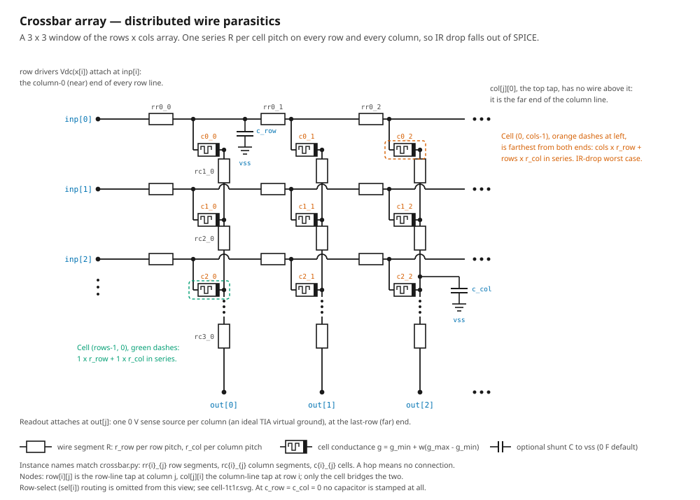
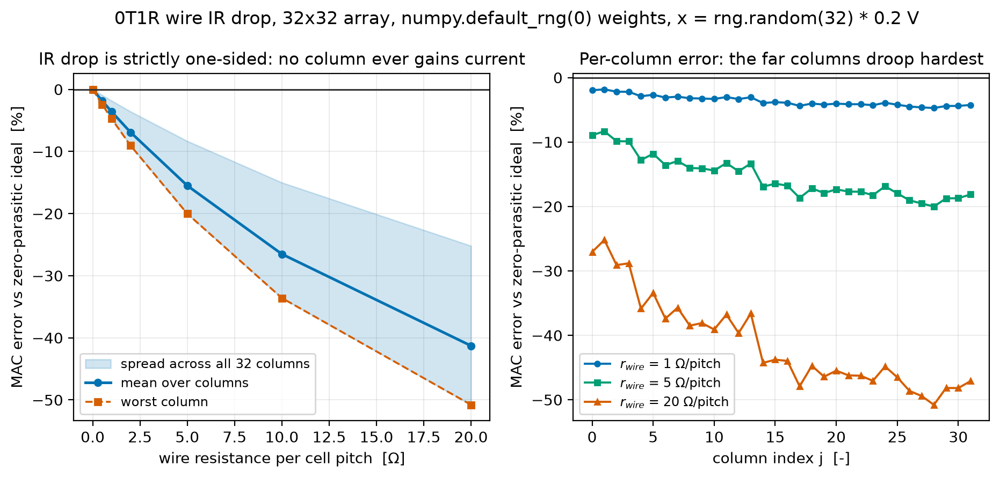
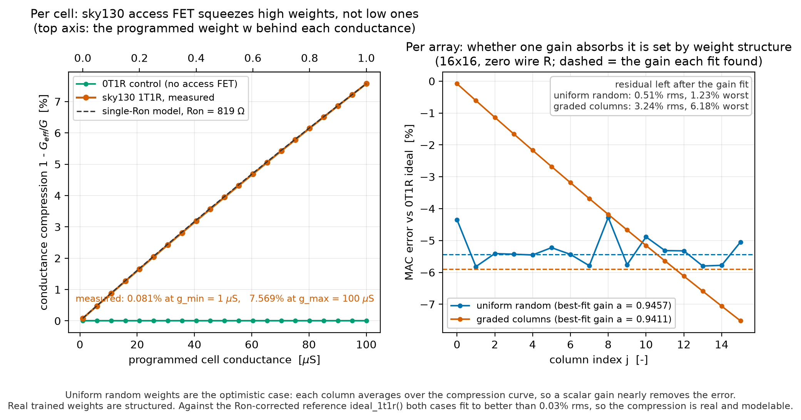
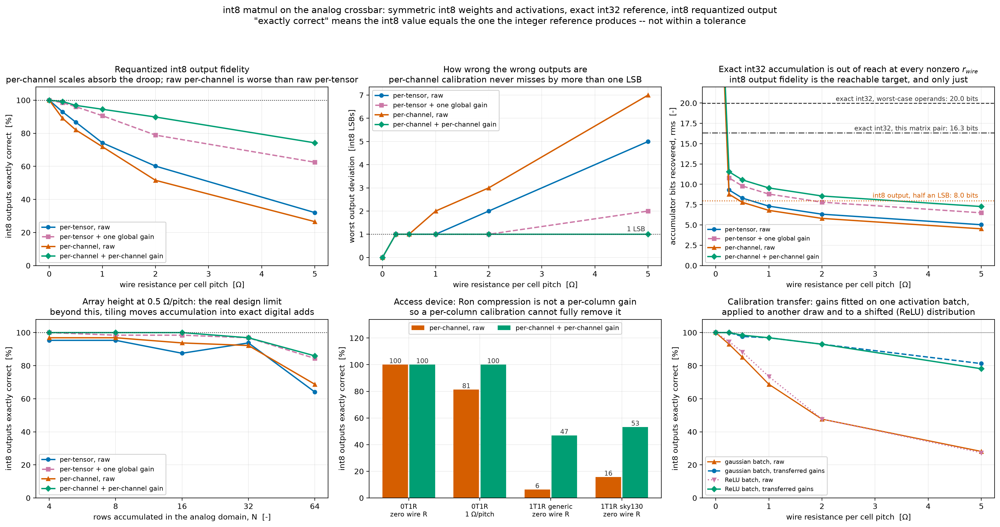

# analog-chip — an Hdl21 compute-in-memory crossbar generator

`crossbar.py` is a parameterized [Hdl21](https://github.com/dan-fritchman/Hdl21) generator for
an analog compute-in-memory (CIM) crossbar — a resistive-memory array that performs a
matrix–vector product in the analog domain — together with the testbenches and cross-checks
that make its results trustworthy. The defining idea is that the **weight matrix is a
generator parameter and the SPICE netlist is a compile output**: programming a weight is an
elaboration-time act, so every distinct cell conductance becomes its own subcircuit. Wire
parasitics are stamped as real devices (one series resistor per cell pitch on every row and
column, plus an optional shunt capacitor per pitch), so IR drop and RC settling fall out of
the simulator instead of out of a spreadsheet. Every operating-point result is cross-checked
against an independent nodal-analysis solve written directly in numpy.

On top of the circuit, `fp_matmul.py` drives the array as a general matrix-multiply engine and
`int8_matmul.py` runs **quantized int8 matmul** on it — int8 weights, int8 activations, exact
int32 reference, int8 requantized output — which gives the study a binary pass/fail criterion
instead of a tolerance. See [int8 matmul on the array](#int8-matmul-on-the-array).

## Scope

**This repository is a netlist generator and a simulation study. It is not a chip.** There *is*
sky130 layout — an interconnect skeleton, and a device-level cell tiled into an array — but it is
drawn to derive parasitics and to check that the cell is legal, not to be taped out.

What is here:

- Hdl21 generators for the cell, the array, and a signed differential tile (`Cell` →
  `Crossbar` → `Tile`).
- Testbenches that emit ngspice decks, run them, and parse the results back into numpy.
- An operating-point and transient study of three effects: wire IR drop, access-device series
  resistance, and wire RC settling.
- Two access-device routes: an uncalibrated placeholder `.model`, and the real sky130
  `sky130_fd_pr__nfet_01v8` via `sky130_hdl21.compile()`.
- An independent numpy MNA solve of the same topology, used as a correctness oracle.
- A float64 matmul engine on top of the array, and an int8 quantized layer on top of that,
  each with its own exactness gate at zero parasitics.

What is **not** here — do not read any of it into the numbers below:

- **No floorplan, no place-and-route, no signoff, no tapeout, no silicon.** There *is* GDS, at
  two levels. `layout_oracle.py` and `array_layout.py` draw a sky130 crossbar **interconnect
  skeleton** — rails, crossings, per-cell via taps — DRC it clean, LVS a single hand-drawn nfet,
  and derive `r_row` / `r_col` / `c_row` / `c_col` from the drawn geometry. `cell_layout.py` then
  draws a **complete device-level 0T1R cell**: one mask-programmed `sky130_fd_pr__res_xhigh_po_0p35`
  poly resistor per cell, DRC clean **with FEOL enabled** (381 rule categories, against 145 with
  the deck's `FEOL = false` default), tiled into a 16 × 16 array that is also DRC clean and
  **LVS-matches** an hdl21 netlist of its 4096 resistors. See
  [docs/LAYOUT.md](docs/LAYOUT.md) §11. What that is *not*: **no RRAM device**, because sky130 has
  none — the resistor is fixed at tapeout, so the array is an inference demonstrator of one frozen
  weight matrix and not a programmable accelerator; the resistor LVS compares the cell's **total**
  length only; `poly.9` self-spacing and every `urpm` marker rule are unchecked by the deck; and
  DRC-clean against one deck at two settings is not tapeout signoff. Nothing has been fabricated
  or measured on silicon.
- **No parasitic extraction.** [docs/LAYOUT.md](docs/LAYOUT.md) computes R from sheet
  resistance and squares and C from area and fringe constants parsed out of the PDK — no field
  solver, and the derived `c_row`/`c_col` carry no coupling term because `Crossbar` has nowhere
  to put one. It separately *measures* coupling and finds two problems: rail-to-rail coupling is
  the same order as the modelled shunt at tight pitches (and unbounded by this work at wide
  ones), and **row-to-column crossing capacitance is topologically unrepresentable** in
  `Crossbar` at any parameter value. So the C model is structurally incomplete, not just
  imprecise. The sweeps below still use *assumed* per-pitch values; LAYOUT.md §11 re-runs the int8
  study on parasitics derived from the drawn cell and lands at **1.755 Ω/pitch** at the default
  `g_min` = 1 µS, and **0.556 Ω/pitch** at the `g_min` that maximizes fidelity — bracketing the
  1 Ω/pitch used as nominal here rather than sitting far above it. (LAYOUT.md §9's earlier
  3.9 Ω/pitch figure is withdrawn: it came from pairing one poly resistor's sheet resistance with
  a different one's name, and §11.1 documents the error.)
- **No memristor device physics.** The cell is a linear resistor whose value is set by the
  weight. There is no nonlinearity, drift, read noise, cycle-to-cycle or device-to-device
  variation, and no write/programming dynamics.
- **No peripheral circuits.** No DAC, no ADC, no sense amplifier, no transimpedance
  amplifier. Columns are held at virtual ground by ideal 0 V voltage sources — a perfect TIA
  with infinite gain and bandwidth and no noise.
- **No inference-accuracy study.** One stimulus vector and one random matrix pair per
  configuration, not a statistical campaign over networks, corners, or device populations. The
  int8 match rates below are measured on random data; they say nothing about top-1 accuracy on
  a real network, which depends on whether the errors land on the argmax.

`docs/REPORT.md` has a full [limitations
section](docs/REPORT.md#limitations-and-threats-to-validity); read it before quoting any
number here.

## The array



Rows are driven at the column-0 end; columns are read out at the last-row end. That asymmetry
is deliberate — it is what produces a spatial IR-drop gradient instead of a uniform offset.
See [`docs/DESIGN.md`](docs/DESIGN.md) for the generator hierarchy and every parameter.

## Setup

```bash
uv sync                 # hdl21 7.0.0, sky130-hdl21 7.0.0, numpy, matplotlib
brew install ngspice    # tested on ngspice-47
```

Optional, and only needed for the `access="sky130"` route:

```bash
uv tool install volare
volare enable --pdk sky130 <version>    # installs under ~/.volare by default
```

The PDK is discovered from `$PDK_ROOT`, then `$VOLARE_ROOT`, then `~/.volare`, accepting both
volare's `<root>/sky130A` symlink and the `.../sky130/versions/<hash>/sky130A` behind it.
Everything except the two sky130 checks runs with no PDK installed; those two skip themselves,
passing.

## Run

```bash
uv run crossbar.py      # 32x32 MAC sweep vs. wire resistance
uv run verify_mna.py    # 9 machine checks, incl. an independent numpy MNA solve
```

`crossbar.py` output, verbatim:

```
32x32, r_wire=0.0 ohm/pitch: mean err   0.00%  worst column  -0.00%  |  after gain fit (a=1.0000): residual rms  0.00%  worst  0.00%
32x32, r_wire=1.0 ohm/pitch: mean err  -3.59%  worst column  -4.72%  |  after gain fit (a=0.9637): residual rms  0.84%  worst  1.87%
32x32, r_wire=5.0 ohm/pitch: mean err -15.50%  worst column -20.01%  |  after gain fit (a=0.8433): residual rms  3.83%  worst  8.70%
```

`verify_mna.py` ends in `VERIFY: PASS` and exits nonzero if any check fails.

## Headline results

All from a 32×32 array, `g_min` = 1 µS, `g_max` = 100 µS, 0T1R cells, `x` uniform in
[0, 200 mV], seed 0, ngspice-47. Full methodology and error bars in
[`docs/REPORT.md`](docs/REPORT.md).

| result | number | why it matters |
| --- | --- | --- |
| ngspice vs. an independent numpy MNA solve | max relative difference **6.6e-12** | two independent solvers, one topology: the netlist is what we think it is |
| IR drop at 1 Ω/pitch | gain droop **−3.59%**, residual after one scalar gain fit **0.84% rms** | most of the error is a calibratable gain, not lost accuracy |
| IR drop at 5 Ω/pitch | gain droop **−15.50%**, residual **3.83% rms / 8.70% worst** | the residual is ~4× smaller than the headline error |
| sky130 access FET at read bias | Ron **844 Ω** = **8.4%** of the 10 kΩ `g_max` cell, **0.08%** of the 1 MΩ `g_min` cell | a per-cell nonlinearity, not a uniform gain: whether a scalar gain removes it depends on the weight distribution |
| array RC pole at 5 Ω and 0.2 fF per pitch | τ₆₃ = **0.69 ps** | the readout amplifier sets read time, not the wire |
| signed differential tile at zero wire R | recovers `(g_max − g_min)·Wᵀx` to **2.0e-15** | the `g_min` offset cancels exactly, as designed |





## int8 matmul on the array

`int8_matmul.py` runs the workload a real compute-in-memory inference accelerator executes:
symmetric int8 weights, symmetric int8 activations, an exact int32 accumulator as the
reference, and an int8 requantized output. Underneath it, `fp_matmul.py` is the analog matmul
engine — it encodes matrices onto the real `Tile`, runs ngspice, and decodes the sensed
currents back to numbers. The pass/fail question is binary: **does the analog path produce the
exact int8 value the integer reference produces?**

```bash
uv run int8_matmul.py       # int8 demo at 0 / 0.25 / 1 / 5 ohm/pitch      ~6 s
uv run verify_int8.py       # 4 checks; int32 exactness is the gate        ~6 s
```

| result | number | why it matters |
| --- | --- | --- |
| zero parasitics, 0T1R | `round(analog)` **equals** `A_q @ B_q` elementwise, over every tested shape and both scale granularities — worst absolute error **3.6e-11** of the 0.5 rounding allows | the encode, decode, tiling and quantization are exact; anything worse at nonzero `r_wire` is physics, not arithmetic |
| 1 Ω/pitch, per-channel + per-channel gain | **94.5%** of int8 outputs exactly correct, worst deviation **1 LSB** | against 71.9% uncalibrated. Per-channel calibration never misses by more than one LSB out to 5 Ω/pitch |
| exact int32 accumulation | needs **20.0 bits** at N = 32; the analog path delivers **6.8–11.5** | unreachable at any realistic parasitic level, which is why the requantized int8 output is the metric and the accumulator is not |
| per-channel scales vs one global gain | **94.5% vs 90.6%** at 1 Ω/pitch, **74.2% vs 62.5%** at 5 Ω/pitch | per-channel weight quantization already carries one multiplier per output channel, so absorbing per-column IR droop costs **no hardware** |
| calibration transfer, Gaussian → ReLU activations | **96.9%** at 1 Ω/pitch, within 0.8 points of refitting in-sample | per-column droop is a property of the array, not the activations, so a one-time factory calibration is real |
| array height at 0.5 Ω/pitch | exact to **N = 16**, 96.9% at N = 32, 85.9% at N = 64 | the analog contraction depth is ~32 rows here, not 128 or 1024 |
| sky130 1T1R, **zero** wire R | **15.6% → 53.1%** with per-channel calibration, against 81.3% → **100%** for pure IR droop | Ron compression is a per-cell nonlinearity, so a per-column gain cannot remove it. The access device is the harder problem |



**Exactness at zero parasitics is a statement about the encoding and the solver, not about
analog computing.** With no wire resistance and a linear resistive cell the crossbar *is* an
exact linear map, and ngspice solves it in float64. The fidelity achievable on any real array
is set by the non-idealities in [`docs/REPORT.md`](docs/REPORT.md) plus two categories this
project does not model at all: **ADC quantization** — there is no ADC, so every match rate
above assumes the accumulator is digitized perfectly — and **device variation**, which in
published ReRAM arrays is frequently the dominant accuracy limit and, unlike IR droop, is not
a per-column gain either. Both would move every number downwards.

### The float engine underneath

`fp_matmul.py` computes `C = A @ B` for arbitrary float64 matrices; int8 is a layer on top.
Weights carry `A` transposed and normalized per block, row voltages carry a column of `B`, and
the `(g_max − g_min)·Wᵀv` identity inverts to give the product back with no fitted gain in the
path. Contraction beyond the array's row count is tiled and accumulated in float64 with a
**per-block scale factor** — block floating point. Inputs are split `b = b⁺ − b⁻` and driven in
two unipolar passes by default, because a real row driver cannot go negative. All `K` input
columns go into **one deck as `2K` instances of the same tile subcircuit**, solved in a single
`.op` — measured **5.2x** faster than one launch per column on the sky130 route.

```bash
uv run fp_matmul.py         # 3 float matmuls at 0 / 1 / 5 ohm/pitch      ~2 s
uv run verify_matmul.py     # 4 checks on the float engine                ~4 s
```

In float terms the same array carries **7.3 of FP32's 24 mantissa bits** at 1 Ω/pitch (8.6
after a gain fit), 5.0 at 5 Ω/pitch, and 48 — the float64 solver floor — at zero parasitics.
The int8 framing is the useful one precisely because "7.3 of 24 mantissa bits" has no pass/fail
reading while "94.5% of int8 outputs exactly right, worst case 1 LSB" does.

Derivations, the accumulator-width argument, cost model, measured timings and the full
limitations list are in [`docs/MATMUL.md`](docs/MATMUL.md).

## Files

| file | role |
| --- | --- |
| `crossbar.py` | `Cell` → `Crossbar` → `Tile` generators, MAC and settling testbenches, error metrics, the sweep in `__main__` |
| `verify_mna.py` | nine machine checks, including the independent numpy MNA solve |
| `int8_matmul.py` | symmetric int8 quantization, requantization, per-channel gain calibration, metrics |
| `verify_int8.py` | four machine checks for the int8 layer; int32 exactness is the gate |
| `fp_matmul.py` | float64 `A @ B` on the array: encode/decode, block-FP tiling, the batched testbench |
| `verify_matmul.py` | four machine checks for the float engine; exactness at zero parasitics is the gate |
| `ngspice_compat.py` | ngspice ≥ 43 rawfile-header shim for vlsirtools 7.0.0; see below |
| `layout_oracle.py` | sky130 tech-constant parser, GDS generation and measurement, R/C from geometry, the DRC harness, the LVS attempt |
| `array_layout.py` | the N×N crossbar interconnect skeleton, derived per-pitch R and C, via/coupling analyses, the accuracy re-run |
| `cell_layout.py` | a device-level 0T1R cell with a real sky130 poly resistor: cell generator, DRC with **FEOL enabled**, cell and array LVS, the `g_min`/area/IR-drop optimum |
| `sram6t.py` | a 6T SRAM bitcell on sky130's three `special_*fet_*` devices: cell generator, butterfly-curve SNM, write margin, read upset, five corners |
| `verify_sram6t.py` | nine machine checks on the bitcell's margins, plus two on the drawn cell under `--layout` |
| `sram_layout.py` | the bitcell drawn: six devices, DRC with **FEOL enabled**, LVS with probes for what it compares, area against the PDK's own bitcell |
| `docs/LAYOUT.md` | the layout→parasitics chain: corner provenance, DRC and LVS status, derived parasitics, the `g_min` pitch loop, the device-level cell (§11), limitations |
| `docs/SRAM6T.md` | the 6T bitcell: the single-bin device constraint, every measured margin and corner, the drawn cell, and the two DRC rules the open PDK uses to forbid its own SRAM devices |
| `docs/DESIGN.md` | generator hierarchy, the differential-pair derivation, full parameter reference |
| `docs/REPORT.md` | methodology, verification, results, limitations, reproduction |
| `docs/MATMUL.md` | the int8 matmul: quantization, the accumulator-width argument, measured fidelity, cost; and the float engine underneath |
| `scripts/render_layout.py` | regenerates the GDS and rasterizes it with sky130's own layer properties |
| `docs/diagrams/` | schematic diagrams (SVG) for the cell, array, tile, and testbench |
| `docs/figures/` | measured result plots (PNG) |
| `docs/layout/` | the drawn layout: GDS you can open in KLayout, plus rendered views |

## The layout

The cell and array are drawn, not described. Full views, the `g_min` = 1 µS versus 20 µS
comparison, and instructions for opening the GDS are in
[docs/LAYOUT.md §12](docs/LAYOUT.md#12-looking-at-the-layout).


Row rails are horizontal met1, one per row, driven with the input voltage. Column rails are
vertical met2, one per column, held at virtual ground. They cross at every cell on different
metal layers — no via there — which is what makes a crossbar legal. Each cell is one
mask-programmed `res_xhigh_po` poly resistor, folded into 16 straight stripes strapped in
series with li1 (straight, because a poly corner is worth 0.5–0.6 of an ill-defined square).

`docs/layout/` also holds the unannotated renders and the GDS itself, including the 16 × 16
array that was DRC'd with FEOL enabled and LVS-matched against an hdl21 netlist of its 4096
devices.

## A 6T SRAM bitcell, aside from the crossbar

`sram6t.py` builds a real 6T bitcell on sky130's three `special_*fet_*` SRAM devices and
measures it: read SNM 297 mV at `tt` and 177 mV at the worst corner, write margin 977 mV, and a
drawn cell that **cannot be DRC clean** because the open PDK's `difftap.1` and `difftap.2` forbid
the transistor widths its own SRAM models are characterized at — the PDK's own bitcell trips 246
violations under the same deck. Full measurements, corners, and the diagnosis are in
[docs/SRAM6T.md](docs/SRAM6T.md).

## Cell configurations

`CellParams.passive=True` is 0T1R — the memristor conductance alone. The default
(`passive=False`) is 1T1R with a series access NMOS, and `CellParams.access` picks the device
model:

| `access` | device | needs a PDK? | calibrated? |
| --- | --- | --- | --- |
| `"generic"` (default) | `.model xbar_nmos_generic nmos level=1 ...` via `h.ExternalModule` | no | **no — placeholder** |
| `"sky130"` | `sky130_fd_pr__nfet_01v8` via `sky130_hdl21.compile()` | yes | yes, tt corner |

**The generic model is a placeholder and is not silicon-calibrated.** It is a level-1 card
with round numbers (`vto=0.5 kp=120u lambda=0.05`) whose only job is to let the 1T1R topology
simulate with no PDK installed — that is, to exercise plumbing. Do not read performance off
it. For scale: its implied Ron at W/L = 1 µm / 180 nm measures **1162.0 Ω** against a level-1
hand estimate of 1153.8 Ω, where the real sky130 `nfet_01v8` in the same testbench comes out
at **818.9 Ω**. The placeholder is 42% pessimistic on Ron. Right order of magnitude, nothing
more.

## The sky130 units gotcha

**This project's public API is SI units everywhere.** `w_acc` and `l_acc` are metres on both
access routes, and the shipped defaults (`w_acc = 1 * µ`, `l_acc = 180 * n`) simulate correctly
as-is. Getting there required working around an upstream `sky130-hdl21` bug, and the workaround
is load-bearing.

The sky130 ngspice library sets `.option scale=1.0u` (via `libs.tech/ngspice/all.spice`), so raw
deck geometry is in **microns**. `sky130-hdl21` 7.0.0 is supposed to convert, in
`Sky130Walker.scale_param` (`sky130_hdl21/pdk_logic.py:351`), but it type-dispatches and silently
skips the conversion for `h.Prefixed`:

```python
if isinstance(orig, h.Prefixed):
    return orig  # FIXME: where's the scaling?
if isinstance(orig, h.Literal):
    return h.Literal(f"({orig.text} * 1e6)")
```

The `FIXME` is upstream's own. A plain `1 * µ` is an `h.Prefixed`, so it would reach ngspice as
`w=1e-06` micron — a 1 pm device — miss every binned `.model`, and fail with nothing but
`could not find a valid modelname`. `si_literal()` converts `Prefixed` → `Literal` on the way
in so the scaling fires, and the deck ends up carrying `w='(1e-06 * 1e6)'` = 1.0 µm.
Consequences:

- Pass SI metres. `w_acc=1.0` means one metre, reaches ngspice as `w=1e+06` micron, and dies
  with the same `could not find a valid modelname`.
- Confirmed by physics, not just by string matching: sweeping `w_acc` over 0.5 µm / 1 µm /
  2 µm moves the measured Ron 1671.4 Ω / 818.9 Ω / 365.1 Ω — a real 1/W trend, which a unit
  slip of 10⁶ could not produce.
- A caveat about the upstream library's own defaults, not about this API: every entry in
  `sky130_hdl21.default_xtor_size` is a `Prefixed` pair (`nfet_01v8` is `0.42 * MICRO`,
  `0.15 * MICRO`), so those defaults take the unscaled path and do *not* simulate against the
  stock ngspice models.

Two checks pin it: `sky130 wiring` asserts the deck literally contains `w='(1e-06 * 1e6)'`,
and `sky130 sim` asserts the measured Ron lands in 300–3000 Ω. A unit slip is a 10⁶× error, so
no plausible device survives that band.

One further sharp edge: `sky130_hdl21.Install` is a process-wide singleton whose
`__post_init__` refuses to be replaced, so `sky130_install()` caches the first PDK it finds for
the life of the process.

## Why `ngspice_compat.py` exists

vlsirtools 7.0.0's `parse_nutbin` reads the ngspice rawfile header *by line count*, assuming
`Title:` / `Date:` / `Plotname:` before `Flags:`. Modern ngspice (confirmed on ngspice-47)
emits an extra `Command:` line, so the parser consumes `Command:` as the plotname and then
trips on `Plotname:` where it expects `Flags:`:

```
ValueError: Invalid flags ['Plotname:', 'Operating', 'Point']
```

The shim rebinds `parse_nutbin` to scan forward to the `Plotname:` line instead of counting,
which works on both old and new ngspice. vlsirtools 7.0.0 is the latest release, so there is
no upstream fix to take instead. Delete this file if a future vlsirtools fixes the parser.

## Verification

`uv run verify_mna.py` runs nine checks and exits nonzero if any fails.

| check | what it asserts |
| --- | --- |
| mna | ngspice column currents vs. a nodal system built directly in numpy |
| op regression | the `.op` error magnitudes above, pinned to 2 dp against drift |
| error metrics | droop is one-sided, and the closed-form best-fit gain matches `lstsq` |
| 1T1R generic | the *default* cell simulates; its Ron matches the level-1 estimate |
| sky130 wiring | `compile` → `nfet_01v8`, `.lib ... tt` from `Install.include`, SI geometry scaled to µm, and a clear actionable error when no PDK is found |
| sky130 sim | the 1T1R `.op` against the real PDK models at default geometry, with Ron in a physical band |
| 1T1R compression | Ron compression is weight-structured: a scalar gain absorbs it for random weights but not for graded ones |
| wire cap | `c_row` / `c_col` build an RC line with the right time constant, linear in `c` |
| signed tile | the column-pair difference recovers `W_signedᵀx` |

The two independent solvers agree to ~1e-12:

```
r= 1.0 ohm/pitch | ngspice vs numpy-MNA: max rel diff 6.58e-12
r= 5.0 ohm/pitch | ngspice vs numpy-MNA: max rel diff 1.01e-12
r=20.0 ohm/pitch | ngspice vs numpy-MNA: max rel diff 1.25e-12
r=   0 ohm/pitch | ngspice vs analytic G.T@x: max rel diff 3.49e-15
```

`sky130 sim` and `1T1R compression` skip themselves, passing, when no model library is
installed, so the suite still passes on a PDK-less machine. Every sky130 number quoted here
was measured against a volare sky130 install under ngspice-47; see
[`docs/REPORT.md`](docs/REPORT.md#reproduction) for exact versions.
