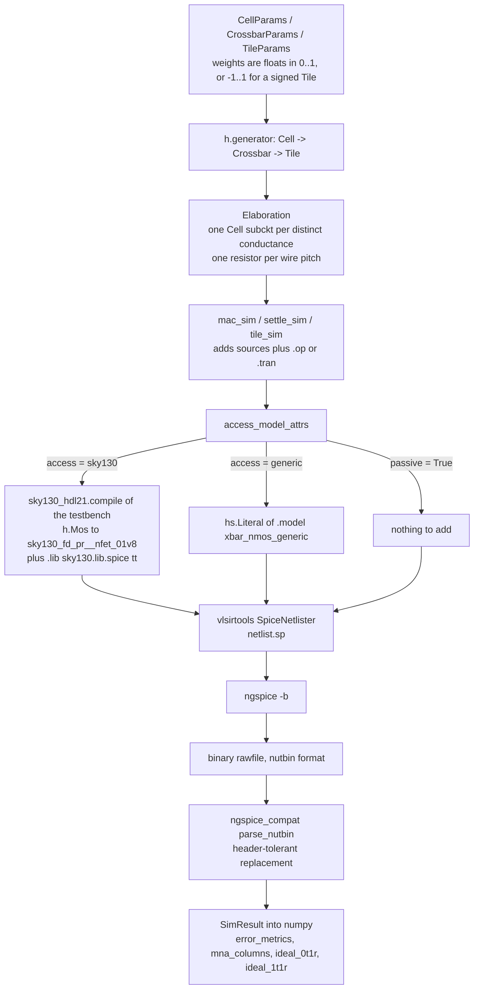
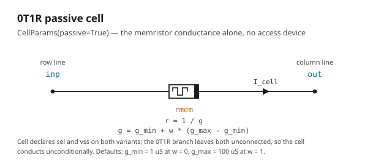
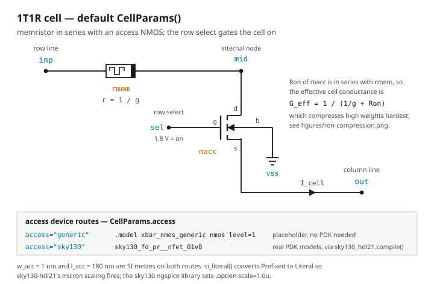
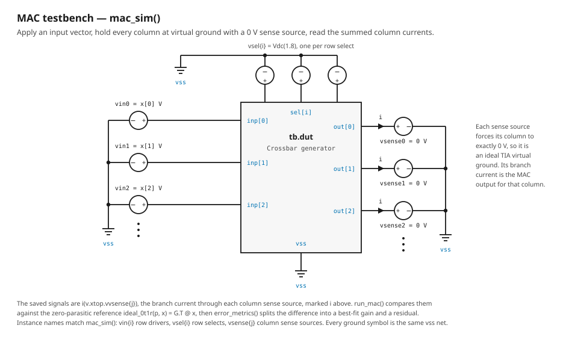

# Design

Everything in this document describes `crossbar.py`: a generator that emits SPICE netlists,
and the testbenches that simulate them. There is **no layout** — no floorplan, no GDS, no
place-and-route, no parasitic extraction, no silicon. The wire resistances and capacitances
below are parameters you assume, not values extracted from a physical implementation. See the
[scope statement](../README.md#scope).

## The central idea: the weight matrix is a parameter, the netlist is a compile output

`CrossbarParams.weights` is an ordinary generator parameter. Programming a weight is therefore
something that happens at **elaboration time**, not at simulation time: by the time ngspice
sees the deck, each cell's conductance is already a hard-coded resistor value.

```python
for i in range(rows):
    for j in range(cols):
        g = p.g_min + p.weights[i][j] * (p.g_max - p.g_min)
        cell = Cell(replace(p.cell, g=g))
        m.add(cell(...), name=f"c{i}_{j}")
```

Each distinct `g` is a distinct `CellParams`, hence a distinct `Cell` generator call, hence its
own subcircuit in the deck:

```
.SUBCKT Cell_f9ca9dd87401cff0ff8bd899ad660020_
+ inp out sel vss
rrmem
+ inp out
+ 10000
.ENDS
```

That is the whole design in one consequence. It is worth being explicit about what it buys and
what it costs.

**Buys.** The deck is self-contained and auditable: the resistor value in the netlist *is*
1/`g`, with no `.param` indirection to chase and no place for a units error to hide. Hdl21's
generator machinery deduplicates identical conductances for free. And every layer above —
`Crossbar`, `Tile`, both testbenches — is written against `CellParams`, so swapping the
memristor for a Verilog-A compact model wrapped as an `h.ExternalModule` changes exactly one
generator.

**Costs.** Subcircuit count scales with the number of *distinct* weights, and a random
floating-point weight matrix has no duplicates at all. Measured:

| array | cells | distinct weights | `.subckt` definitions | subcircuit instances |
| --- | --- | --- | --- | --- |
| 2×2 | 4 | 4 | 6 | 5 |
| 4×4 | 16 | 16 | 18 | 17 |
| 32×32 | 1024 | 1024 | 1026 | 1025 |

(The two extra definitions in each row are the `Crossbar` itself and the testbench module,
which vlsirtools emits as the `xtop` subcircuit — hence the `v.xtop.vvsense{j}` current probes
below.) A quantized weight matrix collapses this immediately: 4-bit weights mean at most 16
`Cell` subcircuits no matter how large the array is. And re-programming a weight means
re-elaborating and re-netlisting; there is no runtime knob.

## Generator hierarchy and elaboration flow



## `Cell`

Four ports: `inp` (row line, `h.Inout`), `out` (column line, `h.Inout`), `sel` (row select,
`h.Input`), `vss` (`h.Port`). `inp` and `out` are `Inout` because current direction is set by
the surrounding circuit, not by the cell.

### 0T1R — `passive=True`



One resistor, `r=1.0/p.g`, from `inp` to `out`. The `sel` and `vss` ports still exist so that
`Crossbar` can wire both cell flavours identically, but nothing inside the cell connects to
them. 0T1R is the configuration used for every IR-drop and settling number in
[`REPORT.md`](REPORT.md), because it isolates the wire effect from the access device.

Real 0T1R arrays have a sneak-path problem — with no per-cell select device, current finds
unintended routes through unselected cells — which this generator does not model as a
*separate* mechanism. It does not have to: with every row driven and every column at virtual
ground, the MNA solve already includes every conduction path in the array.

### 1T1R — the default



`inp` → memristor → internal node `mid` → access NMOS (drain `mid`, gate `sel`, source `out`,
bulk `vss`) → `out`. The FET is in **series** with the memristor, so its Ron adds directly to
the cell resistance. That series resistance, not the FET's role as a switch, is what dominates
the 1T1R results — see [Access-device results](REPORT.md#access-device-1t1r-results).

Two routes, chosen by `CellParams.access`:

| `access` | how it is built | model source | needs a PDK |
| --- | --- | --- | --- |
| `"generic"` (default) | `h.ExternalModule` named `xbar_nmos_generic`, `spicetype=SpiceType.MOS`; the matching `.model` card is injected into the sim by `access_model_attrs` as an `hs.Literal` | `.model xbar_nmos_generic nmos level=1 vto=0.5 kp=120u lambda=0.05 gamma=0.0 phi=0.7 tox=4.1n` | no |
| `"sky130"` | an `h.Nmos(family=h.MosFamily.CORE)`, which `sky130_hdl21.compile()` rewrites in place to a `sky130_fd_pr__nfet_01v8` subcircuit instance | the PDK's `libs.tech/ngspice/sky130.lib.spice`, section `tt`, added via `Install.include(Corner.TYP)` | yes |

**The generic route is a placeholder and must not be used for performance claims.** It is a
level-1 card with round numbers whose only purpose is to let the 1T1R topology simulate on a
machine with no PDK installed — that is, to exercise topology and plumbing. Its implied Ron at
the default geometry measures 1162.0 Ω against a level-1 hand estimate of 1153.8 Ω, which
confirms only that it is the model we wrote down; the real `nfet_01v8` at the same W/L in the
same testbench is 818.9 Ω, so the placeholder is 42% pessimistic. It has no velocity
saturation worth the name, no realistic mobility degradation, no series source/drain
resistance, and no correspondence to any process. Any conclusion about read speed, energy, or
accuracy drawn from it is a conclusion about a fiction.

## `Crossbar`


Ports: `inp` (`h.Inout`, width `rows`), `out` (`h.Inout`, width `cols`), `sel` (`h.Input`,
width `rows`), `vss`.

### The distributed parasitic model

Wire resistance is stamped as one resistor **per cell pitch**, on every row and every column:

```
row i:   inp[i] --R_row-- row[i][0] --R_row-- row[i][1] -- ... -- row[i][cols-1]
col j:   col[j][0] --R_col-- col[j][1] -- ... -- col[j][rows-1] --R_col-- out[j]
cell:    row[i][j] --1/G[i,j]-- col[j][i]
```

so a `rows`×`cols` array carries `rows*cols` row resistors and `cols*rows` column resistors —
including one stub at each end, from the driver to the first row tap and from the last column
tap to the readout. Nothing about IR drop is modeled by hand; it is whatever the resulting
nodal system says it is, and [`verify_mna.py`](../verify_mna.py) asserts that ngspice and an
independent numpy solve of that system agree.

Wire capacitance is optional and stamped as one shunt capacitor **per tap** to `vss`, gated on
a truthiness test:

```python
if p.c_row:
    for i, rl in enumerate(rows_):
        for j in range(cols):
            m.add(h.Cap(c=p.c_row)(p=rl[j], n=m.vss), name=f"cr{i}_{j}")
```

With the default `c_row = c_col = 0.0` that branch does not execute, so **no capacitor card is
emitted at all** — not a zero-valued one. This matters because it makes the operating-point
netlist, and therefore every `.op` number in the report, identical to what an R-only generator
would produce. Measured on a 2×2 array:

| `c_row` = `c_col` | capacitor cards | resistor cards |
| --- | --- | --- |
| `0.0` (default) | **0** | 12 |
| `1e-15` | **8** (4 row taps + 4 column taps) | 12 |

(12 = 4 row-pitch + 4 column-pitch + 4 cell resistors, the last one inside each `Cell`
subcircuit.)

`vss` is used only as the capacitor return and the access FET's bulk. In a 0T1R run with
`c=0` it is a port that nothing inside the array connects to; the testbench's single `vss` port
becomes ngspice node `0`.

### The driver / readout asymmetry

Drivers attach at the **column-0 end** of each row. Readout attaches at the **last-row end** of
each column. The series wire resistance in the path from the driver of row `i` to the readout
of column `j`, through cell (`i`,`j`), is therefore

```
R_path(i, j) = r_row * (j + 1)  +  r_col * (rows - i)
```

which is maximal at cell (0, cols−1) — nearest the driver along the row, farthest from the
readout along the column — and minimal at (rows−1, 0). The gradient runs along the
anti-diagonal, and it is the reason the error is a spatial pattern rather than a single offset.
If drivers and readout attached at the same corner, the two terms would partly cancel and the
array would look better than it is.

A caution against reading too much into that formula: it accounts for surprisingly little of
the observed droop, because each wire segment carries the summed current of *every* cell
sharing it, not just the current of the cell behind it. Taking `R_path` as a series resistance
per cell and nothing else predicts a mean droop of only −0.22% at 1 Ω/pitch and −1.09% at
5 Ω/pitch, where the full solve gives −3.59% and −15.50%. Roughly 93% of the droop at
5 Ω/pitch is shared-segment loading. This is exactly the kind of thing hand analysis gets
wrong and a nodal solve gets right.

Setting `r_row = r_col = 0.0` still stamps resistors, at 0 Ω; ngspice replaces them with 1 pΩ
and says so (`Warning: Value of resistor ... is too small, set to 1.000000e-12`). The
zero-resistance reference case is therefore a 1 pΩ-per-pitch case, which agrees with the
analytic `Gᵀx` to 3.5e-15 relative — i.e. the substitution is numerically irrelevant.

## `Tile` — signed weights on a unipolar array


A memristor conductance is positive. A weight is not. `Tile` resolves that with the standard
differential column-pair scheme: each signed weight `w ∈ [−1, 1]` becomes **two physical
columns**,

```
G+ = g_min + max(+w, 0) * (g_max - g_min)
G- = g_min + max(-w, 0) * (g_max - g_min)
```

and the answer is read as the difference of the two column currents. The reason this works is
that the `g_min` offset cancels exactly. For `w ≥ 0`, `max(+w,0) = w` and `max(−w,0) = 0`:

```
G+ - G-  =  [g_min + w*(g_max - g_min)]  -  [g_min + 0]
         =  (g_max - g_min) * w
```

and for `w < 0`, `max(+w,0) = 0` and `max(−w,0) = −w`:

```
G+ - G-  =  [g_min + 0]  -  [g_min + (-w)*(g_max - g_min)]
         =  (g_max - g_min) * w
```

One expression covers both signs, with no `g_min` term in it. Summing over rows,

```
I(outp[j]) - I(outn[j])  =  (g_max - g_min) * Σ_i x_i * w[i][j]
```

which is `(g_max − g_min) · Wᵀx`, with the scale factor known at design time. `g_min` — the
part of a resistive cell you cannot program away — has been removed from the answer by
construction rather than by calibration. Measured agreement with that expression is 2.0e-15
relative at zero wire R; see [Signed tile results](REPORT.md#signed-tile-results).

**Why the pair is adjacent columns.** The two legs are physical columns `2j` and `2j+1`. Wire
IR droop varies smoothly along the array, so neighbouring columns see nearly the same droop,
which makes it common-mode to first order and partly cancels in the subtraction. Splitting the
pair — all `G+` columns on one side, all `G−` on the other — would turn a common-mode error
into a differential one.

Be careful how much credit that argument gets. Measured on the 8×8 signed tile at 5 Ω/pitch,
the absolute error of the difference (mean 266 nA) is smaller than the absolute error of either
leg on its own (326 nA and 298 nA), which can only happen if the two leg errors are positively
correlated — so the cancellation is real. But it is partial, and the differential signal is
also smaller than either leg (mean 16.6 µA against 25.0 µA), so the *relative* error of the
difference (mean −1.71%, worst column 3.17%) is no better than the per-leg relative error
(−1.36% and −1.53%). The differential pair's guaranteed win is the exact cancellation of
`g_min`, not immunity to IR drop. Details in
[Signed tile results](REPORT.md#signed-tile-results).

**Removed knobs.** `TileParams` used to carry `mux`, `adc_bits` and `in_bits`. They are gone.
There is no ADC generator and no DAC generator in this project, so those were parameters with
no circuit behind them: no netlist element would have changed and no simulation would have
responded to setting them. Carrying them would have implied a mixed-signal design that does not
exist. They come back when there is an actual readout generator to configure. `signed` stays,
and both branches elaborate — `signed=False` gives one column per weight and the plain
`Crossbar` port list.

**One wiring subtlety.** The signed branch builds a `2*cols`-wide `Crossbar` and connects it
through `h.Concat(*reversed(pairs))`. The reversal is required because `Concat` parts land on
the target's bits in reverse order. This was established against ngspice and is pinned by the
`signed tile` check in `verify_mna.py`; if it were wrong, the sign of every column would be
scrambled and that check would fail loudly.

## Testbenches



### `mac_sim(p, x)` — the operating point

- One `h.Vdc(dc=x[i])` per row from `inp[i]` to `vss`: an ideal voltage driver, no output
  impedance and no DAC nonlinearity.
- One `h.Vdc(dc=1.8)` per row on `sel[i]`: all rows selected simultaneously, which is the
  full-parallel MAC case and the worst case for IR drop.
- One **`h.Vdc(dc=0.0)`** per column from `out[j]` to `vss`. This is the key modeling choice: a
  0 V voltage source is a perfect virtual ground *and* a perfect ammeter, which is exactly what
  an ideal transimpedance amplifier is. It holds the column at 0 V with zero error and reports
  the current that flows into it. A real TIA has finite gain, finite bandwidth, input-referred
  offset and noise, and its own input impedance; none of that is here.
- `hs.Op()` plus `.save all`.

Column current is read out of the sense source by name:

```python
spice = np.array([data[f"i(v.xtop.vvsense{j})"] for j in range(cols)])
```

`xtop` is the testbench module as vlsirtools names it; `v.` and the doubled `v` in `vvsense`
are the netlister's device-type prefixes on the instance name `vsense{j}`. SPICE reports
current through a voltage source as positive when it enters the `+` terminal, and `+` is the
column node, so this value is the column current directly, with no sign flip: a positive
number means current flowing out of the array into the sense node.

### `settle_sim(p, x, tstop, tstep)` — the transient

Identical to `mac_sim` except the row drivers are `h.Vpulse(v1=0, v2=x[i], delay=10*tstep,
rise=tstep, fall=tstep, ...)` and the analysis is `hs.Tran`. Only the column-current probes are
saved, not `all`. The 10-step delay gives a clean pre-step baseline; `verify_mna.settle_tau`
subtracts it before reporting τ. The select lines stay at a static 1.8 V — this measures the
array's own RC response to an input step, not a row-select transition.

### References and metrics

| function | what it returns | valid when |
| --- | --- | --- |
| `ideal_0t1r(p, x)` | `Gᵀx`, the zero-parasitic 0T1R answer | 0T1R only, and only as a *reference*, not a prediction, once wire R is nonzero |
| `ideal_1t1r(p, x, ron)` | `(1/(1/G + ron))ᵀx`, series-Ron-corrected | 1T1R; approximate, since Ron depends on Vgs and Vds |
| `error_metrics(spice, ideal)` | `(signed mean rel. error %, best-fit gain a, signed worst rel. error %, rms residual % after removing a, worst residual % after removing a)` | the gain/residual split is clean for wire IR drop; on 1T1R the residual also carries Ron compression, and how much of *that* a scalar gain removes depends on the weight distribution — most of it for i.i.d. weights, little of it for structured ones |
| `run_mac(p, x)` | `(spice column currents, ideal_0t1r)` | warns when handed a 1T1R cell, because the returned reference is then wrong by construction |
| `run_tile_mac(p, x)` | `(I(outp) − I(outn), (g_max − g_min)·Wᵀx)` | signed `Tile` |

The best-fit gain is closed-form, `a = (spice·ideal)/(ideal·ideal)`, the argmin of
`‖spice − a·ideal‖`; `verify_mna.py` cross-checks it against `np.linalg.lstsq`.

## Parameter reference

### `CellParams`

| field | type | unit | default | meaning |
| --- | --- | --- | --- | --- |
| `g` | `float` | S | `10e-6` | Programmed cell conductance. `Crossbar` overwrites this per cell from `weights`, `g_min` and `g_max`, so the default only applies when `Cell` is used standalone. |
| `w_acc` | `h.Scalar` | **metres (SI)** | `1 * µ` | Access-device width. Pass a prefixed value such as `1 * µ`; see the note below. |
| `l_acc` | `h.Scalar` | **metres (SI)** | `180 * n` | Access-device length. |
| `passive` | `bool` | — | `False` | `True` selects 0T1R: memristor only, no access device. |
| `access` | `str` | — | `"generic"` | `"generic"` or `"sky130"`. Ignored when `passive=True`. Anything else raises `ValueError`. |

> **`w_acc` / `l_acc` are SI metres on both routes.** This is not what the raw deck contains,
> and the difference is an upstream bug this project works around.
>
> The sky130 ngspice library sets `.option scale=1.0u`, so deck geometry is in **microns**.
> `sky130-hdl21` 7.0.0 is supposed to convert, in `Sky130Walker.scale_param`
> (`sky130_hdl21/pdk_logic.py:351`), but it type-dispatches and skips the conversion for
> `h.Prefixed`:
>
> ```python
> if isinstance(orig, h.Prefixed):
>     return orig  # FIXME: where's the scaling?
> if isinstance(orig, h.Literal):
>     return h.Literal(f"({orig.text} * 1e6)")
> ```
>
> The `FIXME` is upstream's own, and the shape of the bug follows from an internal convention
> that a `Prefixed` size is *already* in microns — the fallback default two lines below is
> `1000 * MILLI`, i.e. the number 1.0, meaning 1 µm. `si_literal()` converts `Prefixed` →
> `Literal` so the conversion fires, and the default reaches the deck as
> `w='(1e-06 * 1e6)'` = 1.0 µm.
>
> The user-facing unit is therefore metres, and a bare `w_acc=1.0` means **one metre**: it
> reaches ngspice as `w=1e+06` micron, misses every binned model, and fails with
> `could not find a valid modelname`. Sweeping `w_acc` over 0.5 µm / 1 µm / 2 µm moves the
> measured Ron 1671.4 Ω / 818.9 Ω / 365.1 Ω, which is a real 1/W trend and not something a 10⁶
> unit slip could imitate. Note that `sky130_hdl21.default_xtor_size` is a table of `Prefixed`
> pairs (`nfet_01v8`: `0.42 * MICRO`, `0.15 * MICRO`), so the *library's own* published defaults
> take the unscaled path and do not simulate against the stock ngspice models — a caveat about
> upstream, not about this generator's API.

### `CrossbarParams`

| field | type | unit | default | meaning |
| --- | --- | --- | --- | --- |
| `weights` | `Matrix` = `Tuple[Tuple[float, ...], ...]` | — | *required* | Normalized weights, rows × cols. In `[0, 1]` for a bare `Crossbar`; in `[−1, 1]` when wrapped in a signed `Tile`. Array shape comes from here: `rows = len(weights)`, `cols = len(weights[0])`. |
| `g_min` | `float` | S | `1e-6` | Conductance at `w = 0`. The programmable floor of a resistive cell — 1 MΩ at the default. |
| `g_max` | `float` | S | `100e-6` | Conductance at `w = 1`. 10 kΩ at the default. The `g_max`/`g_min` ratio, 100, is the usable dynamic range. |
| `r_row` | `float` | Ω per cell pitch | `1.0` | Row-wire series resistance, one resistor per pitch. |
| `r_col` | `float` | Ω per cell pitch | `1.0` | Column-wire series resistance, one resistor per pitch. |
| `c_row` | `float` | F per cell pitch | `0.0` | Row-wire shunt capacitance to `vss`, one capacitor per tap. **`0.0` stamps no capacitor card at all.** |
| `c_col` | `float` | F per cell pitch | `0.0` | Column-wire shunt capacitance to `vss`. Same. |
| `cell` | `CellParams` | — | `CellParams()` | Cell template. `g` is overwritten per cell; every other field is used as given. Note the default is **1T1R with the placeholder model**, so `cell=CellParams(passive=True)` is required for a pure-wire study. |

Per-cell conductance is `g_min + weights[i][j] * (g_max - g_min)`, so `weights` is a
normalized coordinate on the conductance range, not a conductance.

### `TileParams`

| field | type | unit | default | meaning |
| --- | --- | --- | --- | --- |
| `xbar` | `CrossbarParams` | — | *required* | Array and parasitics. When `signed=True`, `xbar.weights` are the **signed** weights in `[−1, 1]`, and the physical array `Tile` builds is twice as wide. |
| `signed` | `bool` | — | `True` | `True`: differential column pairs, ports `outp` / `outn`, each `cols` wide. `False`: one column per weight, port `out`, `cols` wide. |

## The sky130 route in detail

`access="sky130"` does three things, in this order, inside `access_model_attrs`:

1. `sky130_install()` discovers the PDK and registers a `sky130_hdl21.Install`. Discovery runs
   *first*, deliberately, so that a missing PDK does not leave a half-compiled testbench
   behind.
2. `sky130_hdl21.compile(tb)` rewrites the testbench **in place**, mapping every `h.Mos` to a
   `sky130_fd_pr__nfet_01v8` subcircuit instance and scaling the geometry.
3. `Install.include(h.pdk.Corner.TYP)` returns the corner library attribute, which emits
   `.lib <root>/sky130A/libs.tech/ngspice/sky130.lib.spice tt`.

A plain `.include` of that file is **not** a substitute. It is `.lib`-sectioned across 30-plus
corners, and a hand-written deck using `.include` did not finish in 300 s where the
`.lib ... tt` form solves in about 10 s.

PDK discovery searches `$PDK_ROOT`, then `$VOLARE_ROOT`, then `~/.volare`, accepting both
volare's `<root>/sky130A` symlink and the `.../sky130/versions/<hash>/sky130A` behind it. When
nothing is found, `sky130_root()` raises a message naming both environment variables, the
missing file, and the install command, rather than letting vlsirtools fail with
`could not find a valid modelname` several layers down. The `sky130 wiring` check asserts all
four of those strings are present.

`sky130_hdl21.Install` is a **process-wide singleton** whose `__post_init__` refuses to be
replaced, so `sky130_install()` caches the first PDK it finds for the life of the process. Any
test that points it at a stub tree must reset `sky130_hdl21.Install.singleton = None`
afterwards or every later check inherits a PDK path that no longer exists — which is precisely
what `check_sky130_wiring` does in its `finally` block.
