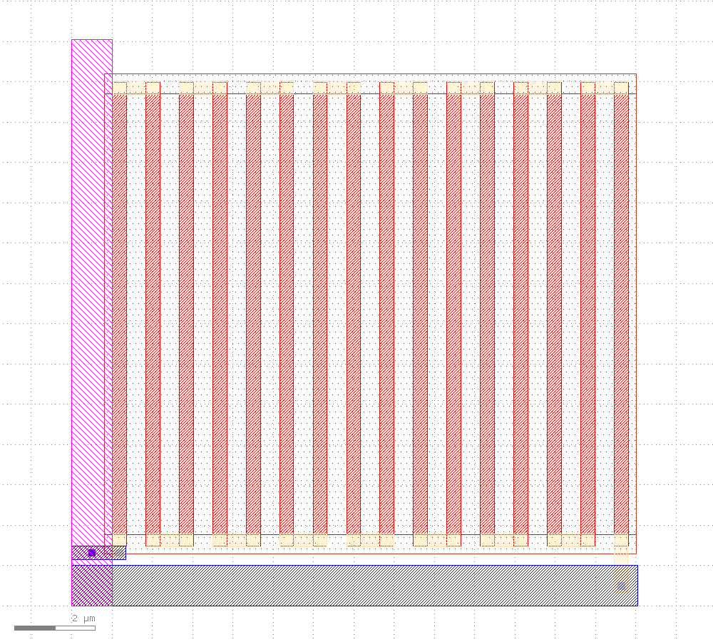
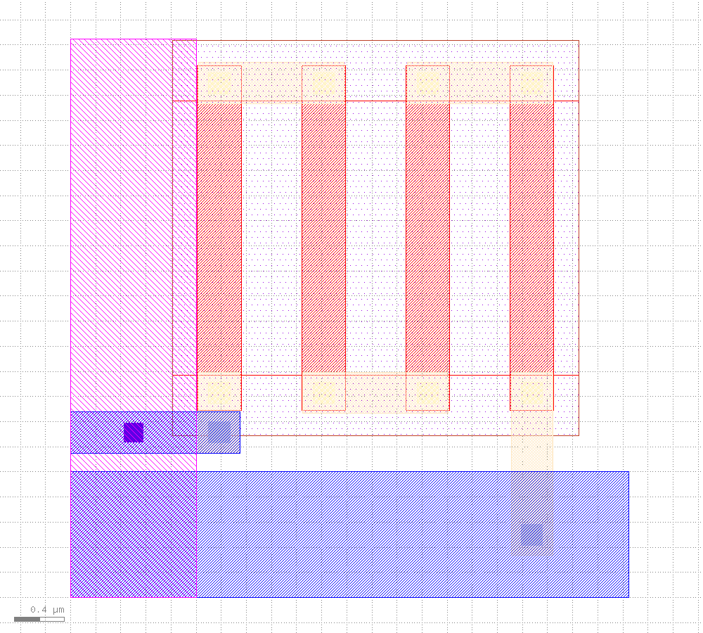
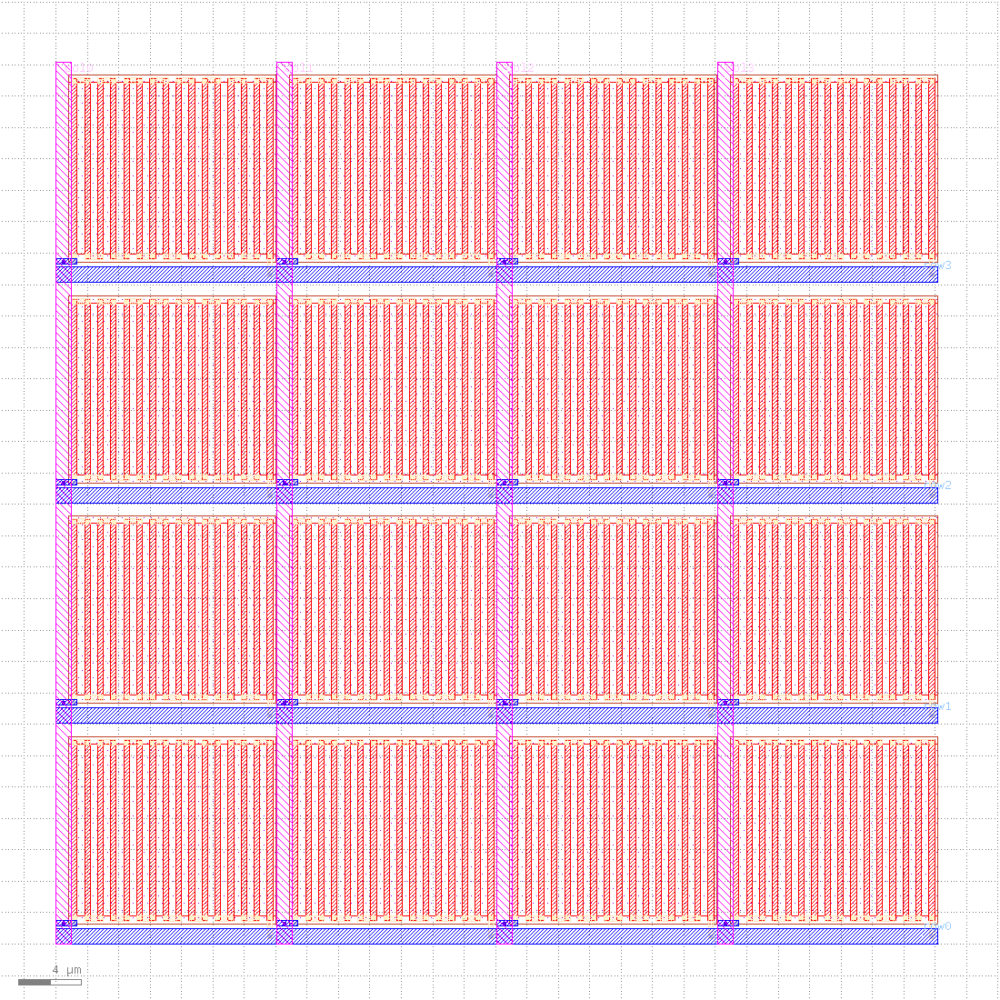
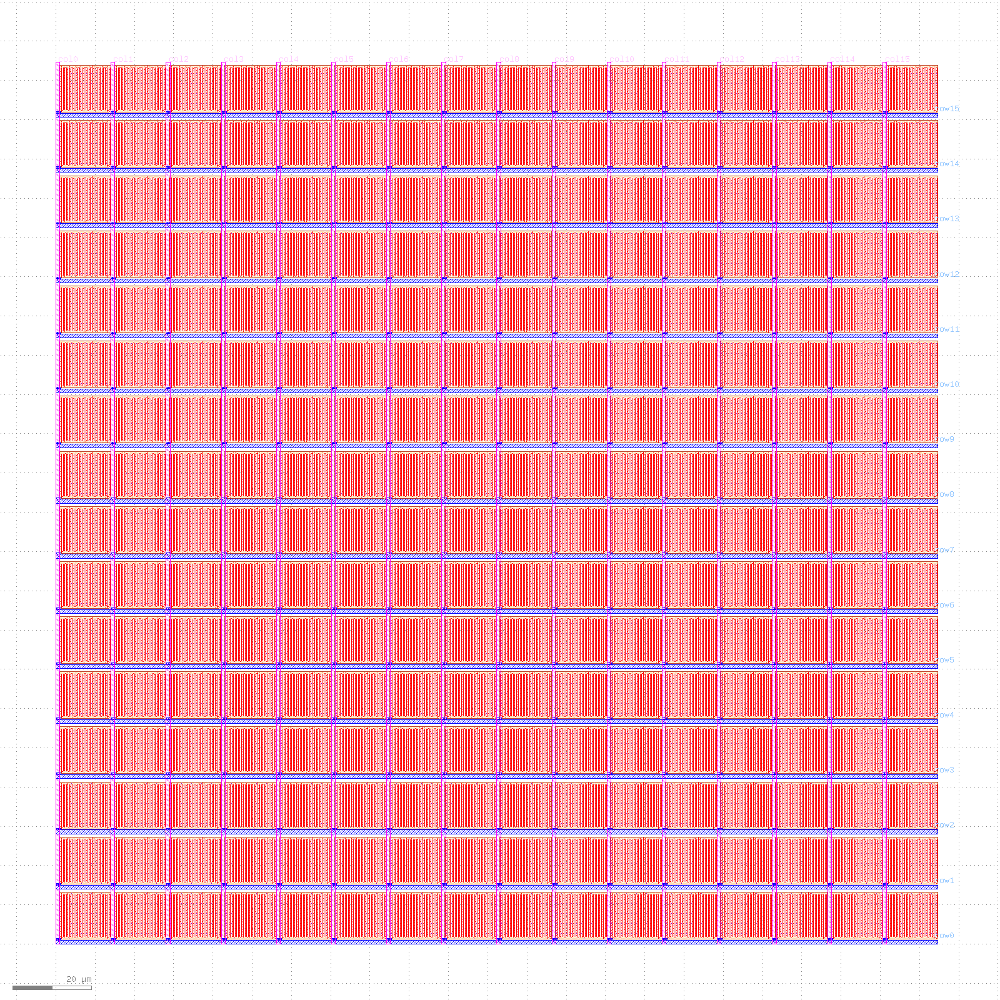

# Layout → parasitics: replacing the assumed wire R and C with geometry-derived ones

[`REPORT.md`](REPORT.md) opens by saying that `r_row` / `r_col` / `c_row` / `c_col` are
**assumed** per-pitch values swept over a plausible range, and that pinning them to real
geometry is the missing step. This document takes that step. Three new modules draw sky130
geometry, DRC it, and compute R and C from the drawn dimensions and process constants parsed
out of the PDK — then re-run the published int8 accuracy study on the result. §1–§10 do that
for the **interconnect**; §11 does it for a **complete device-level cell** with a real sky130
resistor in it, which is what finally makes the pitch an output rather than an assumption.

**Read this first, because the distinction decides what the numbers below are worth.** What
runs here is

```
R = sheet_resistance(layer) · squares(polygon)
C = area_cap(layer) · area(polygon) + perimeter_cap(layer) · perimeter(polygon)
```

with every constant parsed from `sky130A.tech`, none typed in. That captures a wire's **self
resistance** and its **area plus fringe capacitance to substrate**. It is **not parasitic
extraction**: there is no field solver, no 3-D coupling matrix, no current crowding, no
frequency dependence. Call it *geometry + technology constants*. Where the difference bites
is documented rather than glossed — §7 shows that rail-to-rail coupling, which this model has
no term for, is the *same order* as the shunt capacitance it does model.

`magic` and `netgen` are not installed on this machine and have no homebrew formula, so
`ext2spice` was never an option; the constants come from magic's technology file, which ships
with the PDK regardless of whether magic does.

**Headline.** The project's default assumption of `r_row = r_col = 1 Ω/pitch` is optimistic.
Any layout that physically holds a `g_min = 1 µS` cell needs a ~30 µm pitch, which puts the
row and column rails at **3.9 Ω/pitch** — near the top of the range the study swept as a
pessimistic case. At that value the int8 match rate with per-channel calibration is **76.6%**,
not the 94.5% the 1 Ω/pitch assumption reports.

> **Correction, from [§11](#11-a-real-device-level-cell-0t1r-with-a-mask-programmed-poly-resistor).**
> The paragraph above is withdrawn and is kept only as the record of what changed. It sized the
> cell with `xhrpoly`'s 319.8 Ω/□, which belongs to `res_high_po`, not to the `res_xhigh_po`
> device whose name and widths §8 used — see [§11.1](#111-the-device-res_xhigh_po-and-the-sheet-resistance-8-attached-to-the-wrong-name).
> On the right device at 2000 Ω/□, a `g_min = 1 µS` cell is **12.80 × 11.50 µm**, the pitch is
> **14.04 µm**, the rails cost **1.755 Ω/pitch**, and the calibrated int8 match rate is
> **90.6%** — and the cell has now been drawn, DRC'd with **FEOL enabled** and LVS'd rather than
> estimated. The direction of §8's argument survives (`g_min` sets the cell area and the cell
> area sets the rail R); its magnitude does not.

Every number below comes from a run on this machine: KLayout 0.30.10 (application) and the
0.30.12 pip module, sky130A via volare, ngspice-47, Apple silicon.

---

## 1. The chain, and how to run it

| module | what it does |
| --- | --- |
| `layout_oracle.py` | tech-constant parser, GDS generation and measurement, R/C computation, the hand check, the DRC harness, the LVS attempt |
| `array_layout.py` | the N×N crossbar interconnect skeleton, per-pitch R and C, the via and coupling analyses, the pitch/resistance loop, the accuracy re-run |
| `cell_layout.py` | §11: a real device-level 0T1R cell with a sky130 poly resistor in it — the cell generator, DRC with **FEOL enabled**, LVS of the cell and of the array, and the `g_min`/area/IR-drop optimum |

```bash
uv run layout_oracle.py                # Stage 1: constants, hand check, DRC both ways, LVS   3.6 s
uv run array_layout.py                 # Stage 2: skeleton, DRC, derived R/C, the analyses    2.5 s
uv run array_layout.py --accuracy      # Stage 2 + the int8 and float re-runs in ngspice     28.6 s
uv run cell_layout.py                  # Stage 3: device cell, FEOL DRC, LVS, array, g_min    ~19 s
uv run cell_layout.py --accuracy       # Stage 3 + the int8 re-run on drawn parasitics     58-66 s
```

Artifacts (GDS, DRC report databases, LVS databases, extracted netlists) land in
`/tmp/layout_oracle`, `/tmp/xbar_layout` and `/tmp/xbar_cell`.

None of the circuit or matmul modules is modified. All three layout modules import `crossbar`,
`fp_matmul` and `int8_matmul` and use them as they are. `cell_layout.py` reuses
`layout_oracle`'s tech parser, GDS helpers, DRC and LVS harnesses and `array_layout`'s
`per_pitch` and `int8_row` rather than reimplementing any of them; the one change it needed
inside `layout_oracle` was an `extra` keyword on `run_lvs` for passing further `-rd` deck
switches, which §11.6 explains it cannot do without.

Two environment requirements that `pyproject.toml` does not express, and should:

- The **`klayout` pip module** (0.30.12 here) provides `klayout.db`, which all three modules
  import for GDS generation and measurement. It is installed in the venv but is **not** in
  `pyproject.toml` or `uv.lock`, so a `uv sync --exact` would remove it and break all of
  them. Add it to `[project].dependencies` before relying on this chain.
- The **KLayout application binary** is separate from the pip module and is what runs the DRC
  and LVS decks — the module cannot execute a `.lydrc`. `layout_oracle.KLAYOUT_BIN` points at
  `~/klayout-local/klayout.app/Contents/MacOS/klayout`; override it or pass `klayout=` to
  `run_drc` / `run_lvs` elsewhere.

---

## 2. Technology constants, and which corner

`sky130A.tech` carries **three** complete sets of resistances and **three** of capacitances,
selected by magic's `variants` mechanism. Getting this wrong scales every resistance in the
project by 105/125 or 145/125 with no other symptom, so here is the resolution in full:

| block | selector | tech-file line | metal1 | what its own comment says |
| --- | --- | --- | --- | --- |
| resistance 1 | `variants (),(orig),(si)` | `sky130A.tech:5100` | **125** mΩ/□ | "Device values come from trtc.cor (typical corner)" |
| resistance 2 | `variants (hrhc),(hrlc)` | `sky130A.tech:5146` | 145 mΩ/□ | "High-end corner resistances" |
| resistance 3 | `variants (lrhc),(lrlc)` | `sky130A.tech:5194` | 105 mΩ/□ | "Low-end corner resistances" |
| capacitance 1 | `variants (),(orig),(si)` | `sky130A.tech:5270` | **25.78** aF/µm² | "Nominal capacitances" |
| capacitance 2 | `variants (hrlc),(lrlc)` | `sky130A.tech:5488` | 20.2 aF/µm² | low-C |
| capacitance 3 | `variants (hrhc),(lrhc)` | `sky130A.tech:5706` | 35.7 aF/µm² | high-C |

**This work uses the `()` blocks** — magic's default extraction style, and the only ones whose
own comments claim typical/nominal. `TechConstants.parse` is a state machine over the
`variants` lines and keeps a value only when the selected corner is in the current block's
selector list.

`TechConstants.check` then asserts the parse against known values and raises with the corner
note attached if any of them moves. That assertion is the only thing standing between a
corner-selection bug and a document full of numbers that are quietly 16% or 20% wrong:

```
resist allm1 = 125 mOhm/square (sky130A.tech:5123)
resist allm2 = 125 mOhm/square (sky130A.tech:5124)
resist allm3 = 47 mOhm/square (sky130A.tech:5125)
resist allm4 = 47 mOhm/square (sky130A.tech:5126)
resist allm5 = 29 mOhm/square (sky130A.tech:5127)
resist allli = 12800 mOhm/square (sky130A.tech:5122)
resist mrp1 = 48200 mOhm/square (sky130A.tech:5115)
resist xhrpoly = 319800 mOhm/square (sky130A.tech:5116)
areacap allm1 = 25.78 aF/um^2 (sky130A.tech:5325)
perimeter allm1 = 40.57 aF/um (sky130A.tech:5326)
sidewall allm1 = 44 aF/um (sky130A.tech:5324)
overlap allm2 over allm1 = 133.86 aF/um^2 (sky130A.tech:5367)
contact mcon = 9300 mOhm/contact (sky130A.tech:5137)
contact m2c = 4500 mOhm/contact (sky130A.tech:5138)
contact nsc = 185000 mOhm/contact (sky130A.tech:5130)
```

Every `TechValue` carries its unit and its source line, and `TechConstants.provenance()`
prints the block above, so any number in this document can be checked with one `grep`.

Layer numbers are read from the PDK's own map, not hardcoded. `Layers` parses
`libs.tech/klayout/tech/sky130A.map` and asserts against what it intends to draw —
`li1 67/20, met1 68/20, met2 69/20, mcon 67/44, via 68/44, via2 69/44` — which is the same
numbering the DRC deck's `m1_wildcard = "68/0-4,6-43,45-*"` selects. Design-rule dimensions
are parsed too, off the deck line that emits each rule (`drc_rule_value("m1.1")` → `0.14`),
so §8's poly-resistor geometry has a `file:line` behind it as well.

---

## 3. The Stage-1 hand check

A 10 µm × 0.5 µm metal1 wire, small enough to check with a pencil. `hand_check` runs the full
pipeline — build GDS with `klayout.db`, write it, read it back, measure area/perimeter/box
sizes, look up constants, compute — and independently computes the same numbers by arithmetic
on `w` and `length` with no GDS involved, then asserts they agree to float precision:

```
  from GDS      met1: 20.000 squares -> R = 2.5 ohm; C = 980.9 aF (128.9 area + 852.0 fringe)
  closed form   met1: 20.000 squares -> R = 2.5 ohm; C = 980.9 aF (128.9 area + 852.0 fringe)
  by hand       10.0/0.5 = 20 squares x 0.125 ohm/sq = 2.5 ohm
                5 um^2 x 25.78 aF/um^2 + 21 um x 40.57 aF/um = 980.87 aF
```

Agreement exercises the GDS write, the read back, the database-unit scaling, the layer lookup
and the constant lookup at once — the failure modes that silently produce numbers off by a
factor of 1000.

---

## 4. The DRC harness, and the deliberate violation

DRC runs the stock PDK deck through the KLayout application in batch:

```bash
klayout -b -zz -r $PDK/libs.tech/klayout/drc/sky130A.lydrc \
        -rd input=<layout>.gds -rd report=<layout>.lyrdb
```

`run_drc` parses the resulting report database (KLayout RDB, XML) into a pass/fail plus a
per-rule violation count. **A DRC harness that has only ever run on clean layouts is not a
tested harness** — a broken report parser and a clean layout are indistinguishable. So
`bad_wire_gds` plants two known violations, 0.10 µm metal1 width against the 0.14 µm minimum
(`m1.1`) and a 0.10 µm gap against the 0.14 µm minimum (`m1.2`), and `main` asserts that the
harness comes back dirty with *exactly* those two rules:

```
  legal wire     DRC CLEAN: wire_met1.gds, 145 rules, 1.20 s
  illegal wire   DRC FAIL: badwire.gds, 2 violations [m1.1 x1, m1.2 x1], 0.79 s
```

**One scope limit on every DRC result in this document.** The stock deck ships with
`FEOL = false` (`sky130A.lydrc:46`), so what actually runs is the back-end-of-line set plus
the off-grid and angle checks: 145 rule categories covering every metal, via and
local-interconnect rule, and **no diffusion or poly rule at all**. The interconnect skeleton
of §6 is drawn entirely in metal1, metal2 and via, so it is fully covered. The transistor of
§5 is barely covered, which is one reason the LVS result there is reported as a device-
recognition result and not a sign-off. The deck was not modified to enable FEOL.

---

## 5. LVS: matched, on `W` and `L` only

**Status: MATCH — but read the next sentence before quoting it.** KLayout's
`DeviceClassMOS4Transistor` treats `AS` / `AD` / `PS` / `PD` as non-primary parameters and
**does not compare them**, so the match is on `W` and `L` alone and the drawn source/drain
areas and perimeters are checked against nothing. This was verified rather than inferred: the
adapted netlist reaches the comparer carrying `AS = 2.9e-7` against the layout's extracted
`0.29`, off by a factor of 10⁶, and LVS reports a match anyway. "LVS MATCH" is a much weaker
statement here than the phrase normally implies, and the weakness is in KLayout's comparison
semantics rather than in the geometry.

With that stated: a hand-drawn `sky130_fd_pr__nfet_01v8` does match a reference netlist
generated through the same hdl21 path `crossbar.Cell` uses, after one documented unit adapter.
Getting there took four distinct fixes, and each one is worth recording because they are the
failure modes anyone repeating this will hit.

First, a correction to the obvious starting point: `libs.tech/klayout/lvs/sky130.lylvs` is a
33-line KLayout macro wrapper whose entire body is a **commented-out** `# %include
sky130.lvs`. Running it checks nothing. The real 109 KB ruleset is `sky130.lvs` beside it, and
`run_lvs` invokes that, the way the PDK's own `run_lvs.py` does.

`crossbar.Cell` itself can never LVS-match: it contains a memristor and sky130 has no
resistive-memory device to match one against. What can be matched is the access device, so
`hdl21_nfet_netlist` builds a one-instance module from the identical `h.Nmos(...,
family=h.MosFamily.CORE)` call, with the same `si_literal` treatment and the same
`sky130_hdl21.compile`, and netlists it.

The four fixes, in the order they were needed:

1. **Top-cell name.** The deck pairs the layout's top cell with the schematic's top circuit
   by name. `Can't find a schematic counterpart for the top cell NFET`. Fixed by naming both
   `nfet_ref` (`NFET_CELL`).
2. **Terminal labels.** The deck reads net names from text layers — `connect(li_con,
   li_label)` at `sky130.lvs:1849`, `connect(poly_con, poly_label)` at `:1848`. Without them
   the extracted subcircuit had **one** pin (`sky130_gnd`) against the schematic's four. Fixed
   with `d`/`s`/`b` texts on li1 (67/5) and `g` on poly (66/5), plus `-rd lvs_sub=b` so the
   deck's global substrate net carries the same name as the schematic's body port.
3. **Subcircuit-to-device conversion.** hdl21 emits the nfet as an `X` subcircuit call. With
   the deck's default `convert_subckts=false` the schematic keeps an *empty, undefined*
   subcircuit, the deck flattens it away as having no layout counterpart, and the comparison
   is one transistor against nothing. Fixed with `-rd convert_subckts=true`, which puts the
   deck's reader delegate (`sky130.lvs:349`, `:416`) on the `X` element and turns it into a
   MOS device.
4. **Units.** This was the actual blocker, and it is a genuine incompatibility rather than an
   oversight on either side. `sky130_hdl21` multiplies device sizes by 1e6 on the way out,
   because the SkyWater ngspice models are used with `.option scale 1E6` and therefore want
   microns — that scaling is the entire reason `crossbar.si_literal` exists. KLayout's SPICE
   reader reads a MOS `W`/`L` as **SI metres** and stores microns, so it multiplies by 1e6
   again. The schematic device arrived as `L = 150000 µm, W = 1000000 µm`. `lvs_netlist_units`
   undoes exactly that one factor on `w` and `l`.

With the adapter, the layout extracts and matches:

```
.SUBCKT nfet_ref b d g s
XM$1 s g d b sky130_fd_pr__nfet_01v8 L=0.15 W=1 AS=0.29 AD=0.29 PS=2.58 PD=2.58
.ENDS nfet_ref

INFO : Congratulations! Netlists match.
```

The extraction recognized the hand-drawn geometry as the right device with the right
dimensions, which is the substantive result: `L = 0.15`, `W = 1`, and source/drain areas and
perimeters that agree with the expressions `sky130_hdl21` emits (`ad = 1·1/1·0.29 = 0.29`,
`pd = 2·1·(1 + 0.29) = 2.58`).

Beyond the `W`/`L`-only limit stated at the top of this section, one more scope caveat:
**this is one transistor, not the array.** No crossbar layout has been LVS'd, because a
crossbar layout with no device in it has nothing to match against — see §6.

### 5.1 The SI-versus-micron boundary is a recurring hazard in this toolchain, not a one-off

Fix 4 above is the **third** time this project has been bitten by the same class of bug. Listed
together they stop looking like three unrelated defects and start looking like a property of
the toolchain: sky130 flows carry geometry in microns, hdl21's public API is SI metres, and
every tool at that boundary picks its own convention with no type to enforce it.

| # | boundary | symptom | resolution |
| --- | --- | --- | --- |
| 1 | `sky130_hdl21.Sky130Walker.scale_param` (`pdk_logic.py:351`) skips the SI→µm scaling for `h.Prefixed` and applies it for `h.Literal`, with upstream's own `FIXME` | a `1 * µ` device reaches ngspice as 1 pm, misses every binned `.model`, and fails with only `could not find a valid modelname` | `crossbar.si_literal` converts `Prefixed` → `Literal` so the scaling fires; see [REPORT.md §8](REPORT.md) and the README's units section |
| 2 | reading the deck's post-scaling `w='(1e-06 * 1e6)'` as if it were already microns | a wrong micron-units reading of correct output | corrected in REPORT.md; the deck value is SI-in, µm-out |
| 3 | KLayout's SPICE reader reads MOS `W`/`L` as **SI metres** and stores microns, while `sky130_hdl21` has already converted to microns | the schematic device arrives at LVS as `L = 150000 µm, W = 1000000 µm`; LVS reports a parameter mismatch with no unit diagnostic | `layout_oracle.lvs_netlist_units` undoes exactly that one 1e6 on `w` and `l` |

All three are silent: none produces a units error, each produces a plausible-looking wrong
number or an error message about something else. The practical rule this suggests for anything
new crossing that boundary is to assert a known dimension end-to-end rather than trust the
convention — which is what §3's hand check and §5's `W = 1, L = 0.15` extraction both do.

---

## 6. The array skeleton

`array_layout.Skeleton` draws the **interconnect** of an N×N crossbar and nothing else:

- N row rails on **metal1**, running in x, width `w_row`.
- N column rails on **metal2**, running in y, width `w_col`, simply crossing over the rows —
  which is what puts a crossbar's two rail families on two layers in the first place.
- One **metal1→metal2 via** per cell off the row rail onto a small metal2 island, offset in x
  so it clears the column rail. The gap between that island and the column rail is where the
  memory device would sit. Nothing is drawn in it.

No memory device is drawn for the blunt reason that **sky130 has none**: `libs.ref` holds
`sky130_fd_pr`, `sky130_fd_io`, `sky130_fd_sc_hd`, `sky130_fd_sc_hvl`, `sky130_ml_xx_hd` and
`sky130_sram_macros`, and no resistive-memory element. That is the scope rather than a gap:
`r_row` / `r_col` / `c_row` / `c_col` *are* interconnect parameters. The cell enters only
through `g_min`, which turns out to set the pitch — §8.

`Skeleton.check` refuses a parameter set that cannot be DRC clean and names the rule, with
every threshold read out of the deck. The DRC run is still the authority, and all three
skeletons below are clean against 145 rule categories — **with the deck's `FEOL = false`
default, so every metal, via and local-interconnect rule ran and no diffusion or poly rule
did** (§4). For this skeleton that is full coverage: it is drawn entirely in metal1, metal2 and
via. The claim "DRC clean" here therefore means clean against the back-end-of-line set, which
is the whole applicable set, and it would not mean that for anything with a transistor in it.

Two things the skeleton does not include, stated so they are not read into the numbers: there
is **no select rail** (a 1T1R array needs one per row; `crossbar.Crossbar` has no `r_sel`
parameter, and adding the rail would widen the pitch), and there is **no periphery** — no
drivers, sense amplifiers or decode.

---

## 7. Derived per-pitch R and C

`r_row` means the resistance of **one more cell pitch** of rail, so that is what is measured:
two rails one pitch apart in length are drawn, measured through the same GDS round trip the
Stage-1 hand check pins, and differenced. Differencing matters — a single rail's perimeter
carries two endcaps worth `2·width`, which at a 0.74 µm pitch is a 30% error on the per-pitch
fringe term if you just divide by N. The difference cancels them exactly.

Three skeletons, `n = 16`:

| skeleton | pitch [µm] | `w_row` / `w_col` [µm] | die area | `r_row` [Ω] | `r_col` [Ω] | `c_row` [F] | `c_col` [F] |
| --- | --- | --- | --- | --- | --- | --- | --- |
| dense | 0.74 | 0.32 / 0.14 | 11.8 × 11.8 µm | **0.289** | **0.661** | 6.62e-17 | 5.77e-17 |
| relaxed | 2.0 | 0.5 / 0.5 | 32 × 32 µm | **0.500** | **0.500** | 1.88e-16 | 1.69e-16 |
| g_min-driven | 31 | 1.0 / 1.0 | 496 × 496 µm | **3.875** | **3.875** | 3.32e-15 | 2.88e-15 |

The `dense` pitch is the minimum this skeleton supports — set by the metal2 island clearing
the column rail on both sides — and it is not reachable in practice because no memory device
fits in 0.74 µm. `g_min-driven` is the one to take seriously; §8 says why 31 µm.

The capacitance splits are worth reading: at these widths the **fringe term dominates the area
term by 3:1 to 31:1** (widest on the 0.14 µm column rail, narrowest on the 1 µm rails).
`c_row` for the dense row rail is 6.1 aF of area against 60.0 aF of fringe. A model that only
counted plate capacitance would be wrong by nearly an order of magnitude.

Settling, using the Elmore expression [`REPORT.md` §6](REPORT.md) already validated
(`R_tot·C_tot/2 = r·c·N²/2`, measured low by a consistent 1.3× against a distributed line):

| skeleton | `r·c·N²/2` | ×1.3 → `tau_63` |
| --- | --- | --- |
| dense | 2.45e-15 s | 3.2e-15 s |
| relaxed | 1.20e-14 s | 1.6e-14 s |
| g_min-driven | 1.64e-12 s | 2.1e-12 s |

**Wire RC is a non-issue at these sizes.** Even the 496 µm array settles in single-digit
picoseconds; the driver and the sense amplifier will set the read time, not the rail.

### The via and contact resistance the circuit model has no term for

`crossbar.Crossbar` puts series R along the rails and nothing at the cell. Priced from the
tech file's `contact` lines, for the `dense` skeleton:

| route | tap R | × rail R per pitch | `g_max` compression |
| --- | --- | --- | --- |
| 0T1R as drawn (1 via) | 4.50 Ω | 15.6× | 0% → **0.045%** |
| 1T1R (via + mcon + li1-to-diff) | 198.80 Ω | 687.7× | 7.570% → **9.238%** |

**The "× rail R per pitch" column is the wrong comparison and is shown only to defuse it.** A
tap resistance sits in series with **one** cell and is shared with nothing, so it produces
none of the shared-segment loading that [`DESIGN.md`](DESIGN.md) measured as ~93% of the droop
at 5 Ω/pitch. Its entire effect is the weight-dependent conductance compression
`crossbar.ideal_1t1r` already models, with `ron` raised by the tap resistance — which is why
the compression column is the one that matters.

- **0T1R as drawn: genuinely negligible.** 4.5 Ω against a 10 kΩ cell at `g_max` is 0.045%.
- **1T1R: not negligible.** The chain down to the access transistor's drain (`via` 4.5 Ω +
  `mcon` 9.3 Ω + `nsc` 185 Ω) is 198.8 Ω, a **24% increase** on the 819 Ω in-array Ron
  [`REPORT.md` §5.2](REPORT.md) measured. That moves `g_max` compression from 7.569% to
  9.238%. It is small, but it is the same order as effects the study treats as significant,
  and it is missing from `crossbar.Crossbar` and from the `ideal_1t1r` reference alike.

### Rail-to-rail coupling: the C model is structurally incomplete

`crossbar.Crossbar` has shunt C to `vss` and nothing else. Three coupling terms exist in the
tech file and none has a counterpart in the model. At all three pitches, aF per cell pitch (per
crossing for the row↔col term):

| skeleton | rail spacing | row → sub (modelled) | row ↔ 2 nbrs | ratio | col → sub (modelled) | col ↔ 2 nbrs | ratio | row ↔ col | ratio |
| --- | --- | --- | --- | --- | --- | --- | --- | --- | --- |
| dense (0.74 µm) | 0.42 µm | 66.1 | 65.1 | **0.98×** | 57.7 | 74.0 | **1.28×** | 48.9 | **0.74×** |
| relaxed (2 µm) | 1.50 µm | 188.1 | 176.0 | 0.94× | 168.5 | 200.0 | 1.19× | 100.5 | 0.53× |
| g_min-driven (31 µm) | 30.0 µm | 3314.5 | 2728.0 | 0.82× | 2883.6 | 3100.0 | 1.08× | 268.0 | 0.08× |

**The two rail↔neighbour columns are upper bounds, and loose ones at the wide pitches.** The
tech file gives **one** sidewall constant per layer with **no stated reference spacing**, and
magic scales coupling with separation inside a `sidehalo` (`sky130A.tech:5027`); this model does
not scale it at all. So those ratios come out nearly spacing-independent by construction, which
is plainly wrong — two rails 30 µm apart do not couple as strongly per micron of length as two
rails 0.42 µm apart. As a sensitivity: *if* the constant is quoted at minimum metal1 spacing
(0.14 µm) and falls as 1/spacing — two assumptions, neither verified, since magic's actual
functional form could not be established without magic installed — the row↔neighbour ratio
becomes ≈0.33× at the dense pitch and ≈0.004× at the g_min-driven pitch. **What survives every
version of that assumption: coupling is comparable to the modelled shunt at tight pitches, and
this work cannot say what it is at 30 µm spacing.**

Two further caveats on the same numbers:

- Adding the **full** perimeter-fringe term and the **full** sidewall term double-counts the
  same physical edge. A close neighbour shields the fringe field that would otherwise reach the
  substrate; magic has `fringeshieldhalo` (`sky130A.tech:5028`) for exactly this and this model
  does not. So the absolute totals are upper bounds too.
- The row↔col **edge-fringe** component assumes the column rail presents `2 · w_row` of edge per
  crossing. That geometry is this module's accounting, not a parsed constant.

#### The part of the verdict that depends on none of that

The **row-to-column crossing capacitance is a different kind of defect, and it is
spacing-independent.** Its plate component is `defaultoverlap allm2 metal2 allm1 metal1` =
133.86 aF/µm² over a drawn `w_row · w_col` overlap — no separation assumption enters, because it
is two shapes on adjacent metal layers with a fixed dielectric between them. At the dense pitch
that plate term alone is 6.0 aF per crossing; with the edge-fringe estimate added, 48.9 aF
(the fringe is 7× the plate at these widths, the same lesson as the fringe-dominates-area
finding above).

It is a direct feedthrough from a **driven row line to a sensed column line** — crosstalk, not
a shunt load. A shunt slows settling; a feedthrough injects charge from the input straight into
the readout before any conductance is involved. **No value of `c_row` or `c_col` can represent
it, because the topology is different**: `Crossbar` has no element between a row node and a
column node other than the cell.

**Verdict: the capacitance model is structurally incomplete, not merely imprecise.** Two
separable problems, at different confidence levels:

1. *Direction certain, magnitude uncertain at wide pitch:* rail-to-rail coupling is comparable
   to the modelled shunt at tight pitches, so `c_row`/`c_col` understate total node capacitance
   — by up to ~2× at the dense pitch, by an amount this work cannot bound at the g_min-driven
   pitch.
2. *Certain, and the magnitude is solid:* the row-to-column crossing term exists, is not small,
   and is topologically unrepresentable in the current model at any parameter value.

Neither touches the DC MAC accuracy the study measures, because a `.op` solve has no capacitors
in it. Both matter for transient reads. [REPORT.md §6.1](REPORT.md) records the consequence for
the settling section.

---

## 8. The pitch/resistance loop: `g_min` sets everything

> **Superseded by [§11](#11-a-real-device-level-cell-0t1r-with-a-mask-programmed-poly-resistor).
> The numbers in this section are wrong** and are kept only as the record of what changed.
> `xhrpoly`'s 319.8 Ω/□ belongs to `res_high_po`. sky130's *highest*-sheet resistor is
> `res_xhigh_po` (`uhrpoly`) at **2000 Ω/□** — 6.25× higher — so every square count, area and
> pitch below is roughly 6× too large. The direction of the argument holds (`g_min` sets the
> cell area, and the cell area sets the rail resistance); the magnitudes do not.

This is the design loop that decides which row of §9's table a real array lands on, and it
runs entirely against the cell, not the wire.

`CrossbarParams.g_min` defaults to 1 µS, i.e. **1 MΩ**. sky130's highest-sheet resistor is
`xhrpoly` at **319.8 Ω/□** (`sky130A.tech:5116`). So:

```
1 MΩ / 319.8 Ω/□                          = 3127 squares
3127 squares × 0.35 µm width              = 1094 µm of line
serpentined at 0.35 + 0.48 = 0.83 µm      = a 30.1 × 30.1 µm block (36 stripes)
```

The 0.35 µm width is the narrowest **binned** `res_xhigh_po` model the PDK ships
(`res_xhigh_po_0p35`), not the DRC minimum: `poly.3` allows 0.33 µm but there is no 0.33 µm
model, and a resistor you cannot simulate is not a design. The 0.48 µm stripe spacing is rule
`poly.9` (`sky130A.lydrc:298`), poly-resistor to poly. Both are parsed from the PDK, not
asserted.

**So a cell that physically holds one `g_min` resistor is ~30 µm on a side, and the cell pitch
cannot be smaller than that.** Which closes the loop: a 31 µm pitch puts 31 squares of metal1
rail in every cell, and 31 × 0.125 Ω/□ = **3.875 Ω/pitch** — four times the project's default
assumption, and 78% of the value it swept as its pessimistic case.

Widening the rail is the available lever and it is a linear one: at 3 µm the rail costs
1.29 Ω/pitch, at 5 µm 0.78 Ω/pitch. It is not free — a 5 µm rail in a 31 µm pitch spends 16%
of the cell's width on one of two rail families — but it is the difference between §9's
bottom row and its middle rows.

### Routing on local interconnect instead

At the `dense` 0.74 µm pitch, each layer at its own minimum width:

| layer | sheet R | min width | R per pitch | × metal1 |
| --- | --- | --- | --- | --- |
| met1 | 0.125 Ω/□ | 0.14 µm | 0.661 Ω | 1.0× |
| met2 | 0.125 Ω/□ | 0.14 µm | 0.661 Ω | 1.0× |
| li1 | **12.800 Ω/□** | 0.17 µm | **55.7 Ω** | 84.3× |

Local interconnect is **102.4× metal1 per square** and must be wider on top of that, which
nets 84.3× per pitch at minimum widths. `MATMUL.md` §3.2 measures 74.2% int8 match at
5 Ω/pitch *with* per-channel calibration; 55.7 Ω/pitch is an order of magnitude past that.
**Routing crossbar rails on local interconnect is not a design.** (The prior estimate of "~100×
worse, tens of ohms per pitch" is confirmed: 102.4× per square, 55.7 Ω/pitch at the dense
pitch, rising linearly with pitch.)

---

## 9. The payoff: the accuracy study on derived parasitics

The configuration is [`MATMUL.md` §3.2](MATMUL.md)'s exactly — `A (16,32) @ B (32,8)`, 16×16
tile, 0T1R, unipolar two-pass, batched, seed 0 — so the derived rows drop straight into the
published table. The assumed rows are re-run here as a control and **reproduce the published
numbers exactly**, including the worst-LSB column, which is the check that the re-run is the
same experiment and not a new one.

int8 outputs exactly correct, %:

| configuration | per-tensor raw | per-tensor + global gain | per-channel raw | **per-channel + per-channel gain** | worst LSB raw → cal | accum bits (rms) |
| --- | --- | --- | --- | --- | --- | --- |
| assumed `r_wire` = 0 | 100.00 | 100.00 | 100.00 | **100.00** | 0 → 0 | 48.63 |
| assumed `r_wire` = 0.25 | 92.97 | 98.44 | 89.06 | **99.22** | 1 → 1 | 11.54 |
| assumed `r_wire` = 1 | 74.22 | 90.62 | 71.88 | **94.53** | 2 → 1 | 9.55 |
| assumed `r_wire` = 5 | 32.03 | 62.50 | 26.56 | **74.22** | 7 → 1 | 7.26 |
| **derived** dense (0.289 / 0.661) | 90.62 | 97.66 | 84.38 | **96.09** | 1 → 1 | 10.54 |
| **derived** relaxed (0.5 / 0.5) | 86.72 | 96.09 | 82.03 | **96.88** | 1 → 1 | 10.55 |
| **derived** g_min-driven (3.88 / 3.88) | 35.94 | 68.75 | 32.81 | **76.56** | 6 → 1 | 7.62 |

The float64 engine on the same operands:

| configuration | rms rel error | max rel error | effective bits (rms) |
| --- | --- | --- | --- |
| assumed `r_wire` = 0 | 2.498e-15 | 3.288e-15 | 48.51 |
| assumed `r_wire` = 0.25 | 1.580e-03 | 1.960e-03 | 9.31 |
| assumed `r_wire` = 1 | 6.290e-03 | 7.800e-03 | 7.31 |
| assumed `r_wire` = 5 | 3.067e-02 | 3.800e-02 | 5.03 |
| **derived** dense | 2.182e-03 | 2.552e-03 | 8.84 |
| **derived** relaxed | 3.155e-03 | 3.913e-03 | 8.31 |
| **derived** g_min-driven | 2.394e-02 | 2.967e-02 | 5.38 |

**What this says about the project's assumption.** The default `r_row = r_col = 1.0` is not a
neutral placeholder — it is optimistic for any array that can actually be built. The
interconnect on its own is cheap: at a pitch tight enough to be interconnect-limited the rails
cost 0.29–0.66 Ω/pitch and the analog path keeps 10.5 accumulator bits. But the pitch is not
set by the interconnect. It is set by the `g_min` resistor, and once the cell is 30 µm wide the
rails cost 3.9 Ω/pitch and the path keeps 7.6 bits. The honest summary is that **this project's
accuracy is limited by `g_min` through the cell area, not by the wire directly** — and the
`5 Ω/pitch` column, which the study presented as a pessimistic bound, is closer to a realistic
sky130 design point than the `1 Ω/pitch` column it treated as nominal.

> **Partly corrected by [§11](#11-a-real-device-level-cell-0t1r-with-a-mask-programmed-poly-resistor).**
> The "30 µm cell" and "3.9 Ω/pitch" above inherit §8's wrong device. On `res_xhigh_po` at
> 2000 Ω/□ the *drawn* cell gives a **14.04 µm** pitch and **1.755 Ω/pitch**, so a realistic
> sky130 design point sits between the `1 Ω` and `2 Ω` columns — **not above `5 Ω`**. The first
> claim survives: accuracy is limited by `g_min` through cell area rather than by the wire
> directly. The claim that `5 Ω/pitch` is the realistic column is withdrawn.

Per-channel calibration holds up: it never misses by more than one LSB at any derived value,
including the g_min-driven one, which is the same conclusion `MATMUL.md` reached at 5 Ω/pitch.

`c_row` and `c_col` are set on the derived rows and cannot move these numbers, because a `.op`
solve has no capacitors in it. What they change is settling — §7.

---

## 10. Limitations

Read these before quoting anything above.

1. **This is geometry + technology constants, not extraction.** Self R from sheet resistance
   and squares; C from area and perimeter constants. No field solver, no 3-D coupling matrix,
   no current crowding, no skin effect, no frequency dependence, no temperature dependence.
   The word "PEX" does not apply and is not used.
2. **The capacitance model is structurally incomplete, by the amount §7 measures.** Coupling to
   neighbouring rails is the same order as the modelled shunt to substrate, and row-to-column
   crossing capacitance has no counterpart in `crossbar.Crossbar` at all. Anything downstream
   of `c_row`/`c_col` inherits that. The row-to-column **edge-fringe** component additionally
   assumes the column rail presents `2 · w_row` of edge per crossing — that geometry is this
   work's accounting, not a parsed constant.
3. **Coupling capacitance has no spacing dependence here.** The tech file gives one sidewall
   constant per layer; magic scales it with separation inside a halo and this does not. The
   coupling figures are upper bounds, more so at wider pitches. Adding the full fringe and full
   sidewall terms also double-counts the same edge, since neither shields the other here.
4. **Interconnect only. There is no memory device, because sky130 has none.** The skeleton is
   rails, crossings and taps. The cell is represented by an empty gap and by its effect on the
   pitch. Nothing here characterizes a memristor.
5. **The skeleton is not a floorplan.** No select rail, no drivers, no sense amplifiers, no
   decode, no power grid, no fill, no antenna handling, no seal ring. A real array's pitch
   would be larger than §8's number, not smaller, and its rail R correspondingly worse.
6. **DRC ran with `FEOL = false`,** the deck's own default. Every metal, via and
   local-interconnect rule ran; no diffusion or poly rule did. The interconnect skeleton is
   fully covered by what ran. The §5 transistor is not.
7. **LVS matched one transistor, on `W` and `L` only.** KLayout's MOS4 comparison ignores
   `AS`/`AD`/`PS`/`PD`, so the drawn source/drain areas and perimeters are unchecked. And a
   match required a µm↔m adapter on the reference netlist, documented in §5 — the raw hdl21
   output does not match, and that is a real tool-interface incompatibility, not a fixed bug.
8. **No crossbar layout has been LVS'd,** because a crossbar layout with no device in it has
   nothing to match against.
9. **Nothing has been signed off or fabricated.** DRC clean against one deck at one setting is
   not tapeout sign-off: no double-patterning checks, no density or antenna sign-off, no
   metal-fill, no corner or reliability analysis. No silicon exists and none is planned here.
10. **The typical corner only.** Every number uses the `()` variants block. The tech file's own
    high-R block would scale metal resistances by 145/125 = 1.16× and the high-C block would
    scale metal1 area capacitance by 35.7/25.78 = 1.38×. Corner spread is not swept.
11. **The `g_min` serpentine is arithmetic, not a drawn layout.** §8 computes squares, length
    and block size from parsed sheet resistance, the PDK's binned device widths and the deck's
    `poly.9` spacing. No serpentine was drawn or DRC'd; corner squares, contact heads and the
    `rpm` marker layer would all make the real block somewhat larger.

---

## 11. A real device-level cell: 0T1R with a mask-programmed poly resistor

Everything above §10 is interconnect. This section closes the loop the other way: it gives up
programmability, draws a **real sky130 device** in the cell, and lets the pitch fall out of the
device instead of being assumed alongside it. `cell_layout.py` is the module.

```bash
uv run cell_layout.py                # cell + FEOL DRC + LVS + array + g_min sweep      ~19 s
uv run cell_layout.py --accuracy     # the above plus the int8 re-run in ngspice       58-66 s
```

Artifacts land in `/tmp/xbar_cell`. Same machine and versions as the rest of this document. The
`--accuracy` figure is a range because ngspice dominates it and varies run to run; everything
else is repeatable to the digit, and the module asserts each DRC and LVS verdict rather than
printing it.

**Headline.** A cell that physically holds a `g_min` = 1 µS resistor is **12.80 × 11.50 µm**, so
the pitch is **14.04 µm** and the rails cost **1.755 Ω/pitch** — not the 3.875 Ω/pitch §8
predicted, and not the 1.0 Ω/pitch the study assumed. §8 was wrong by 5.5× in area for a reason
worth stating plainly: it paired one device's sheet resistance with another device's name (§11.1).
The cell is DRC clean **with FEOL enabled** (381 rule categories, against 145 with the stock
deck's `FEOL = false`), and both the cell and a 16 × 16 array of it LVS-match hdl21 reference
netlists built from the PDK's own resistor device.

### 11.1 The device: `res_xhigh_po`, and the sheet resistance §8 attached to the wrong name

sky130 ships **two** families of binned poly precision resistor, on two different marker layers,
with a 6.25× difference in sheet resistance and — the trap — confusing names in magic's
technology file:

| magic type-set | sheet R | tech-file line | marker | the device it extracts as | `device` line |
| --- | --- | --- | --- | --- | --- |
| `xhrpoly` | 319.8 Ω/□ | `sky130A.tech:5116` | `rpm` 86/20 | `sky130_fd_pr__res_high_po` | `:6036` |
| `uhrpoly` | **2000 Ω/□** | `sky130A.tech:5117` | `urpm` 79/20 | `sky130_fd_pr__res_xhigh_po` | `:6136` |

The type-set named "xhrpoly" is the device named "**high**\_po"; the type-set named "uhrpoly" is
the device named "**xhigh**\_po". [§8](#8-the-pitchresistance-loop-g_min-sets-everything) took
319.8 Ω/□ from the first row and the *name* and *binned widths* from the second, i.e. two halves
of two different devices. Both families happen to ship the same five widths — 0.35, 0.69, 1.41,
2.85, 5.73 µm — so nothing failed loudly; the number was just 6.25× too small.

**`res_xhigh_po` is the right choice on both counts.** It needs 6.25× fewer squares, and its
constant is self-consistent where the other one is not:

- `sky130_fd_pr__res_xhigh_po__base.model.spice` sets `rsheet = 2000.0` with
  `rbody = l*rsheet/w`, and the LVS deck's extractor is handed **2000** (`sky130.lvs:2254`).
  Three independent files in the PDK agree exactly.
- `res_high_po`'s own binned models put `rsheet` in ohms per µm of length, so the effective sheet
  resistance is `rsheet · w` and it is **width-dependent**: 389.3 Ω/□ at the 0.35 µm bin,
  339.0 at 0.69, 324.4 at 1.41, 323.6 at 2.85, 323.5 at 5.73. The tech file's single 319.8 is the
  wide-line asymptote, so using it at the narrowest bin — which is what §8 did, and what any
  area-minimizing design does — is **22% optimistic**.

The chosen device is `sky130_fd_pr__res_xhigh_po_0p35`: 0.35 µm wide, 2000 Ω/□.

**Width is not a free parameter.** The LVS deck recognizes a bin by looking for an edge of that
length in the marked body (`poly_xhigh_0p35 = poly_res_2k.interacting(...with_length(0.34.um,
0.36.um))`, `sky130.lvs:1412`), and the DRC deck's `poly.3` sets a 0.33 µm floor under all of
them. A drawn width that is not one of the five bins extracts as no device at all. Length is the
only knob.

### 11.2 The device decision: 0T1R, no access transistor — and what that costs

**There is no access FET, and for a mask-programmed array that is not a simplification, it is
the correct topology.** The access device in a real RRAM array does two jobs: it isolates one
cell so a write pulse lands only there, and it blocks sneak paths when part of the array is
addressed. A mask-programmed resistor array does neither, because:

- **There is no write.** The conductance is set by drawn length at tapeout. Nothing to isolate.
- **No node floats during a MAC.** Every row is driven by a source and every column is held at
  virtual ground by the sense path, so the array is a fully-determined resistive network with no
  high-impedance node for a sneak current to develop across. This is not an argument, it is
  already measured: [`REPORT.md`](REPORT.md) records 0T1R arrays matching an independent numpy
  MNA solve to ~1e-12, which is impossible if there were unaccounted conduction paths.

Deleting the access FET deletes the two largest precision limiters the project measured — the
7.57% `g_max` Ron compression of [`REPORT.md` §5](REPORT.md) (4.3 effective bits against 6.5)
and the 198.8 Ω of 1T1R tap resistance of §7 above. Both go to zero.

**The honest cost: the weights freeze at tapeout.** This is an inference-only demonstrator of a
*fixed* linear map, not a programmable accelerator. Retargeting it to a different weight matrix
is a new mask set. Everything the project says about analog matmul fidelity still applies; nothing
it says or could say about programming, endurance, retention or drift applies, because there is
no programmable element left.

One further honest note, which cuts the other way from the brief's framing: `g_max` is **not**
drawn. The cell is sized for the *largest* resistance in the array, `1/g_min`, because every cell
must physically hold whatever resistor its weight calls for and the pitch is set by the worst
case. A `g_max` cell is 5 squares of the same stripe in the same 14.04 µm box, mostly empty.

### 11.3 The cell layout: straight bars, strapped in series, not a poly serpentine

The brief for this work said "serpentine". The cell does not serpentine the **poly**; it draws
`stripes` straight bars and wires them in series with **li1 straps** that alternate top and
bottom. Three reasons, in order of weight:

1. **A poly corner has no exact square count.** It is worth somewhere between 0.5 and 0.6 squares
   depending on the conformal map, and a *precision* resistor whose value depends on a corner
   count is not precise. Straight bars give `squares = Σ L/W` exactly.
2. **LVS gets stronger.** Each bar is an independently extracted `res_xhigh_po_0p35` with its own
   drawn length; a continuous serpentine is one device whose `L` KLayout would have to
   square-count through the corners.
3. **It is nearly free.** The head overhead is `2 × 0.28 µm` per stripe against a stripe body
   tens of times longer, so the strapped block is **+6.2%** in side length against the equivalent
   continuous serpentine (12.80 µm vs 12.05 µm). The module prints both numbers every run.

The layer stack, all of it required and all of it cross-checked against the DRC deck's own
`polygons(l, d)` calls rather than hardcoded:

| layer | GDS | role |
| --- | --- | --- |
| `poly` | 66/20 | the bars, plus a contact head at each end |
| `poly_rs` | 66/13 | marks the **body**. The LVS deck takes `poly ∖ poly_rs` as the terminals (`poly_con`, `sky130.lvs:1166`), so this marker's edge — not the contact — is what sets the extracted `L` |
| `urpm` | 79/20 | the 2 kΩ/□ bin selector |
| `psdm` | 94/20 | p+ implant; `poly_res_2k` requires it (`sky130.lvs:1410`) |
| `npc` | 95/20 | nitride poly cut; `licon.15` and `licon.18` require it over every poly contact |
| `licon` | 66/44 | poly contact, exactly 0.17 µm square |
| `li1`, `mcon`, `met1`, `via`, `met2` | 67/20, 67/44, 68/20, 68/44, 69/20 | the straps and the two terminal taps |

Cell floorplan, one pitch square: the **met1 row rail** runs in x along the bottom, the **met2
column rail** in y along the left, and the resistor block sits above and right of both. The last
bar's bottom head taps straight down to the row rail through licon → li1 → mcon. The first bar's
bottom head taps down to a met1 island that runs left under the column rail and takes a via up to
it. The row terminal's li1 crosses over that island on a different layer with no mcon between
them, which is the only thing keeping the two nets apart.

Every dimension is parsed from the deck line that emits its rule — 28 of them, printed each run:

```
        ct.1 0.17         ct.2 0.19         li.1 0.17         li.3 0.17
        li.5 0.08         li.6 0.0561    licon.1 0.17     licon.15 0.1
     licon.2 0.17      licon.8 0.05         m1.1 0.14         m1.2 0.14
        m1.4 0.03         m1.5 0.06         m1.6 0.083        m2.1 0.14
        m2.2 0.14         m2.5 0.085        m2.6 0.0676   n/psdm.1 0.38
       npc.1 0.27        npc.2 0.27       poly.3 0.33       poly.9 0.48
       rpm.2 0.84        rpm.3 0.2        via.1a 0.15      via1.5a 0.085
```

### 11.4 The cell, with dimensions

At the project's default `g_min` = 1 µS, i.e. a 1 MΩ cell:

```
  1000 kohm target -> 16 x 10.94 um of 0.35 um res_xhigh_po = 500.1 squares = 1000.23 kohm body
  16 stripes at 0.83 um stripe pitch (0.35 drawn + 0.48 poly.9 space), 0.28 um contact head per end
  resistance, drawn:  body                    1000.23 kohm  (500.1 squares x 2000 ohm/square)
                      16 contact heads           9.40 kohm  (0.93% of the cell, at 587.8 ohm/stripe from the model)
                      li1 straps                 0.48 kohm  (0.05%)
                      total                   1010.12 kohm  -> g = 0.9900 uS against the 1 uS asked for
  cell bounding box: 14.04 x 14.04 um (197.1 um^2), block 12.80 x 11.50 um at (1.01, 1.49)
```

| quantity | value | where it comes from |
| --- | --- | --- |
| stripes | 16 | the count that makes the block squarest, since a square block minimizes the *pitch* |
| body length per stripe | 10.94 µm | `1/g_min / 2000 Ω/□ × 0.35 µm / 16`, snapped to the 5 nm grid |
| squares | 500.114 | `16 × 10.94 / 0.35`, exact for rectangles |
| stripe pitch | 0.83 µm | `0.35` drawn + `0.48` (`poly.9`, resistor-to-poly space) |
| poly block | 12.80 × 11.50 µm | `16 × 0.83 − 0.48` by `10.94 + 2 × 0.28` |
| **cell pitch** | **14.04 µm** | block + `urpm` enclosure (`rpm.3`, 0.2) + `urpm`-to-`urpm` gap (`rpm.2`, 0.84) |
| contact-head resistance | 9.40 kΩ | 16 × 587.8 Ω/stripe, the model's own `rcon(w)` polynomial |
| strap resistance | 0.48 kΩ | 15 straps × 0.83 µm of li1 at 12.8 Ω/□ over a 0.33 µm pad |

**The contact and strap resistance is a real cost of the strapped topology and it is not zero.**
At 1 MΩ it is 0.98% of the cell — nothing. At 20 kΩ (`g_min` = 50 µS) the same overhead is
**5.6%**, because the contact count falls linearly with the stripe count while the body falls
linearly with total length. The module reports the drawn `g` including it (0.9900 µS, not 1.0),
and the `g_min` sweep and the int8 re-run both use the drawn value.

**Two PDK statements of the contact resistance, and they disagree by 1.93×.** The device's own
model gives `rcon = −46.62/w² + 331.73/w + 20.576` = **587.8 Ω** per stripe for both heads
(`sky130_fd_pr__res_xhigh_po__base.model.spice`); magic gives `contact pc,xpc 152000`
(`sky130A.tech:5136`), i.e. 2 × 152 = **304 Ω** for the same two cuts. Both are parsed, both are
reported, and the **model's** figure is the one used downstream because it is the one that would
actually simulate. Swapping to magic's moves the `g_min` optimum's accumulator bits by 0.01 —
the conclusion does not depend on the choice, which is why it is safe to state one.

**The SI-versus-micron hazard, closed end to end.** [§5.1](#51-the-si-versus-micron-boundary-is-a-recurring-hazard-in-this-toolchain-not-a-one-off)
lists three silent unit failures in this toolchain and a resistor adds two more places to have
one: a drawn length in database units, and a model `l` that a tool may read as metres. So
`verify_cell` reads the written GDS **back** and re-derives everything from the measured polygons
before anything downstream runs:

```
  measured back out of cell.gds: 16 marked bodies, widths [0.35], lengths [10.94] um
  -> 175.04 um of marked resistor, 500.1143 squares, 1000.23 kohm; matches the plan exactly
```

and KLayout's LVS extractor, reading the same file through an entirely different code path,
independently reports `L = 175.04`. Note also that **magic and KLayout do not agree on what `l`
means for this device**: magic's extraction rule is `l=l+0.16` (`sky130A.tech:6058`), KLayout's is
the marked length itself. Neither is wrong. Neither can be assumed.

### 11.5 DRC with FEOL enabled — and proof that enabling it changed something

**This is the decisive difference from §4 and §6.** The stock deck ships `FEOL = false`
(`sky130A.lydrc:46`), which was defensible for a metal-only skeleton and would be meaningless
here: a poly resistor is almost entirely front-end geometry. The flag is a plain Ruby assignment,
not a `-rd` variable, so `feol_deck` writes a **patched copy** with `FEOL = true` and leaves the
PDK read-only.

| layout | `FEOL = false` | `FEOL = true` |
| --- | --- | --- |
| rule categories | 145 | **381** |
| the cell | CLEAN, 1.17 s | **CLEAN, 1.71 s** |
| the 16 × 16 array | — | **CLEAN, 1.79 s** |
| the cell with its stripes narrowed to 0.32 µm | **CLEAN** | **FAIL: `poly.3` ×16, `licon.8a` ×32** |

Enabling FEOL adds **236 rule categories**, and the cell needed no geometry changes to pass them
— the layout was built from the FEOL rule values in the first place, so the run is a confirmation
rather than a debug loop.

**The planted violation.** A FEOL-enabled harness that has only ever run on clean layouts is not
a tested harness, and §4's `bad_wire_gds` proves nothing about the front-end half of the deck
because it is metal only. So `bad_cell_gds` takes the real cell and narrows its resistor stripes
by one grid step below `poly.3`'s 0.33 µm minimum — one edit, on grid so the off-grid rules stay
quiet — and the module asserts that the result is **clean with FEOL off** and trips **`poly.3`
once per stripe** with FEOL on. It also trips `licon.8a` ×32, which is correct and not noise: the
same narrowing drops the poly enclosure of each contact from 0.09 µm to 0.075 µm against that
rule's 0.08 µm. Both are front-end rules; both are invisible to the stock deck.

Two limits on the FEOL result that the run does not let you forget:

- **`poly.9` does not check a resistor against itself.** It is coded as
  `poly.and(rpm.or(urpm).or(poly_rs)).separation(poly.or(difftap), 0.48, ...)`, and when the
  resistor *is* the poly on both sides of the comparison the check degenerates. Verified directly:
  two 0.30 µm resistor stripes at 0.30 µm spacing report `poly.3` twice and **not** `poly.9`. The
  layout honours the 0.48 µm rule anyway, but DRC did not prove that it does.
- **The deck codes no `urpm` rules at all.** `rpm.1a` … `rpm.10` exist for the 86/20 marker;
  the only rules that mention `urpm` are `poly.3` and `poly.9`. So the `urpm` width and spacing
  used here (1.27 µm and 0.84 µm, borrowed from `rpm.1a` and `rpm.2`) are honoured by
  construction and **unchecked by this deck**. A `res_high_po` cell would get the full marker rule
  set at 6.25× the area; that is the real trade behind §11.1's device choice.

### 11.6 LVS: matched, and this time the comparison is not hollow

**Status: MATCH, on the cell and on the 16 × 16 array.**

```
  as hdl21 emits it                      LVS NO MATCH
  um->m adapter, no schematic_simplify   LVS NO MATCH
  um->m adapter + schematic_simplify     LVS MATCH
```

```
.SUBCKT xbar_cell b col row
XR$1 row col b sky130_fd_pr__res_xhigh_po_0p35 R=1000228.57143 L=175.04 W=0.35
+ A=61.264 P=361.28
.ENDS xbar_cell
```

The reference netlist is built through hdl21 from `sky130_hdl21.ress["PM_PREC_0p35"]`, the PDK's
own `ExternalModule` for `sky130_fd_pr__res_xhigh_po_0p35`. It is instantiated **directly** rather
than through `h.PhysicalResistor`, because `Sky130Walker`'s resistor path discards the caller's
length and substitutes `default_prec_res_L` (`pdk_logic.py:254`) — every cell would netlist as a
0.35 µm resistor. As in §5, the deck used is `sky130.lvs`, never the `sky130.lylvs` stub.

**What is actually compared — measured, not read off the deck.** §5's MOS match turned out to be
much weaker than "LVS MATCH" implies, so the same question is put to this device empirically by
breaking one thing at a time:

| what was changed | result | conclusion |
| --- | --- | --- |
| nothing | MATCH | baseline |
| `L` × 1.004 (+0.4%) | MATCH | inside the tolerance |
| `L` × 1.006 (+0.6%) | **NO MATCH** | **`L` is compared, and the 0.5% tolerance is real** — the boundary is measured, not quoted |
| `L` × 1.10 | NO MATCH | — |
| device bin `0p35` → `0p69` | **NO MATCH** | the bin is compared, through the extracted device class name |
| schematic `R = 0` vs extracted `R = 1000228.6` | MATCH anyway | **`R` is not compared** |
| schematic `W = 0` vs extracted `W = 0.35` | MATCH anyway | **`W` is not compared** |

That matches the deck's own declaration — `BResistorFixedWidth` at `sky130.lvs:465` sets
`enable_parameter("R", false)`, `("W", false)`, `("L", true)`, and `:2255` puts a 0.5% relative
tolerance on `L` — and it is a **materially stronger** result than §5's. `L` is the one parameter
the resistance depends on (`R = 2000 · L / W`), and `W` being uncompared costs nothing because it
is pinned by the bin: a wrong drawn width does not extract as this device at all.

Two things the match does **not** cover, both discovered rather than assumed:

- **It checks the total length, not the subdivision.** KLayout's resistor device class combines a
  series chain during extraction, so the 16 drawn bars arrive at the comparer as **one** device
  with `L = 175.04`. A cell drawn as 8 bars of 21.88 µm would compare equal. The square count is
  verified; the geometry that produced it is not.
- **It needs `-rd schematic_simplify=true`.** The deck combines series devices on the layout side
  inside the extractor and on the schematic side only behind that switch, whose default is
  `false` (`sky130.lvs:1073`). Without it a correct layout and a correct netlist do not match, and
  the diagnostic says only "Netlists don't match".

**A fourth instance of the units hazard of §5.1, and it is a new one.** KLayout's SPICE reader
reads a resistor's `l` as **SI metres** and stores micrometres, exactly as it does a MOS `W`/`L`:
`l=11.67` arrives as `L = 11670000`. `layout_oracle.lvs_netlist_units` already undoes precisely
this factor and needed no change — its regex matches `l='...'`, and `mult='1'` is not a false
positive because `\b` does not fire mid-word. The "as hdl21 emits it" row above is that failure,
reproduced deliberately.

### 11.7 The array at the real pitch, and its parasitics

`array_gds` puts the full-length rails in the top cell and instantiates the unit cell as one
`CellInstArray`. That is not tidiness — flat, a 16 × 16 array of a 16-stripe cell is ~50 000
polygons, and the DRC deck runs `deep`, so the hierarchy is what keeps a FEOL run on the array in
the same time class as a run on one cell.

```
  /tmp/xbar_cell/array.gds  224.6 x 224.6 um, 256 cells, 4096 resistor stripes
  met1 3708.3 um^2, poly 16486.4 um^2 (32.7% of the die in resistor)
  FEOL on   381 rules  DRC CLEAN: array.gds, 381 rules, 1.79 s
  LVS       LVS MATCH
```

**A crossbar layout has now been LVS'd.** [§10.8](#10-limitations) said none had been, on the
grounds that a crossbar with no device in it has nothing to match against. With a device in the
cell that reason is gone: 256 cells × 16 stripes = **4096 drawn resistors** against an hdl21
netlist of the same, matched hierarchically on the `xbar_cell` subcircuit, with 16 met1 row labels
and 16 met2 column labels naming the rails.

Per-pitch R and C come from `array_layout.per_pitch` unchanged — two rails one pitch apart in
length, measured through the same GDS round trip §3's hand check pins, and differenced. Nothing
about the method changed; only the pitch, which is now a device output:

| | pitch | `w_row`/`w_col` | `r_row` | `r_col` | `c_row` | `c_col` |
| --- | --- | --- | --- | --- | --- | --- |
| project default **assumption** | — | — | 1.0 | 1.0 | 0 | 0 |
| §7 `relaxed` skeleton | 2.0 µm | 0.5 | 0.500 | 0.500 | 1.88e-16 | 1.69e-16 |
| §9 `g_min-driven` skeleton | 31 µm | 1.0 | 3.875 | 3.875 | 3.32e-15 | 2.88e-15 |
| **this cell, drawn** | **14.04 µm** | **1.0** | **1.755** | **1.755** | **1.501e-15** | **1.306e-15** |

The Elmore settling estimate [`REPORT.md` §6](REPORT.md) validated gives `r·c·N²/2` = 3.37e-13 s
and, with that section's measured 1.3× correction, τ₆₃ ≈ **0.44 ps**. Wire RC remains a non-issue.

### 11.8 The int8 study on the drawn parasitics

Same configuration as [§9](#9-the-payoff-the-accuracy-study-on-derived-parasitics) and
[`MATMUL.md` §3.2](MATMUL.md) — `A (16,32) @ B (32,8)`, 16 × 16 tile, 0T1R, unipolar two-pass,
batched, seed 0 — so every row is comparable. The assumed rows reproduce the published numbers
exactly. The drawn rows use the drawn `g_min` (including contact and strap resistance) and the
derived `r_row`/`r_col`/`c_row`/`c_col` for that cell's own pitch.

| configuration | pt raw | pt + gain | pc raw | **pc + per-channel gain** | worst LSB raw → cal | accum bits (rms) |
| --- | --- | --- | --- | --- | --- | --- |
| assumed `r_wire` = 0 | 100.00 | 100.00 | 100.00 | **100.00** | 0 → 0 | 48.63 |
| assumed `r_wire` = 0.25 | 92.97 | 98.44 | 89.06 | **99.22** | 1 → 1 | 11.54 |
| assumed `r_wire` = 1 | 74.22 | 90.62 | 71.88 | **94.53** | 2 → 1 | 9.55 |
| assumed `r_wire` = 5 | 32.03 | 62.50 | 26.56 | **74.22** | 7 → 1 | 7.26 |
| §9 `g_min-driven`, 3.875 | 35.94 | 68.75 | 32.81 | **76.56** | 6 → 1 | 7.62 |
| **drawn** `g_min` 1 µS, r 1.755 | 61.72 | 80.47 | 57.81 | **90.62** | 3 → 1 | 8.75 |
| **drawn** `g_min` 2 µS, r 1.376 | 71.09 | 84.38 | 61.72 | **91.41** | 2 → 1 | 9.09 |
| **drawn** `g_min` 5 µS, r 0.925 | 73.44 | 88.28 | 71.09 | **93.75** | 2 → 1 | 9.63 |
| **drawn** `g_min` 10 µS, r 0.717 | 73.44 | 89.06 | 71.88 | **94.53** | 2 → 1 | 9.92 |
| **drawn** `g_min` 20 µS, r 0.556 | 74.22 | 89.84 | 71.88 | **94.53** | 2 → 1 | **10.08** |
| **drawn** `g_min` 30 µS, r 0.510 | 70.31 | 86.72 | 71.88 | **94.53** | 2 → 1 | 9.94 |
| **drawn** `g_min` 40 µS, r 0.510 | 63.28 | 85.16 | 64.84 | **91.41** | 2 → 1 | 9.65 |
| **drawn** `g_min` 50 µS, r 0.501 | 57.03 | 85.16 | 61.72 | **91.41** | 2 → 1 | 9.24 |

**What this changes about §9's conclusion.** §9 said the project's accuracy is limited by `g_min`
through the cell area, and that the `5 Ω/pitch` column was closer to a realistic sky130 design
point than the `1 Ω/pitch` column. The first half survives and is now sharper; the second half
does not. On the correct device the realistic point is **1.755 Ω/pitch and 8.75 bits** at the
project's default `g_min`, and **0.556 Ω/pitch and 10.08 bits** at the best `g_min` — between the
study's `1 Ω` and `0.25 Ω` columns, not near its `5 Ω` one. §9's headline was pessimistic by
2.2× in `r_wire` and by 1.1–1.5 effective bits, entirely because of §11.1's device mix-up.

Per-channel calibration holds up everywhere, never missing by more than 1 LSB at any drawn point —
the same conclusion §9 and `MATMUL.md` reached.

### 11.9 The `g_min` optimum, and it is a real one

Because the cell area is now computed from the target resistance, sweeping `g_min` is nearly free.
Geometry and currents, at N = 16, V = 0.2 V, `g_max` = 100 µS, 1 µm rails:

| `g_min` [µS] | 1/`g_min` [kΩ] | squares | stripes | pitch [µm] | area [µm²] | `r_wire` [Ω] | δ = `g_max`−`g_min` [µS] | I_cm [µA] | IR drop [mV] | pitch set by |
| --- | --- | --- | --- | --- | --- | --- | --- | --- | --- | --- |
| 1 | 1000 | 500.1 | 16 | 14.04 | 197 | 1.755 | 99 | 3.2 | 0.048 | urpm gap (x) |
| 2 | 500 | 250.0 | 10 | 11.01 | 121 | 1.376 | 98 | 6.4 | 0.075 | tap stack + block (y) |
| 5 | 200 | 100.0 | 8 | 7.40 | 55 | 0.925 | 95 | 16.0 | 0.126 | urpm gap (x) |
| 10 | 100 | 50.0 | 6 | 5.74 | 33 | 0.717 | 90 | 32.0 | 0.195 | urpm gap (x) |
| **20** | **50** | **25.0** | **4** | **4.45** | **20** | **0.556** | **80** | **64.0** | **0.302** | tap stack + block (y) |
| 30 | 33 | 16.7 | 4 | 4.08 | 17 | 0.510 | 70 | 96.0 | 0.416 | urpm gap (x) |
| 40 | 25 | 12.5 | 4 | 4.08 | 17 | 0.510 | 60 | 128.0 | 0.555 | urpm gap (x) |
| 50 | 20 | 10.0 | 2 | 4.01 | 16 | 0.501 | 50 | 160.0 | 0.682 | tap stack + block (y) |

`I_cm` is the per-column common-mode floor `N · g_min · V`, the current a column carries with every
weight at zero. `IR drop` is that current's ladder sum along the column, `Σᵢ i · I · r_col` =
`r_col · I · N(N+1)/2`.

**The optimum is `g_min` ≈ 20 µS, at 10.08 accumulator bits (rms) and 94.53% calibrated int8
match.** It is a genuine interior maximum: fidelity climbs monotonically from 8.75 bits at 1 µS to
10.08 at 20 µS, then falls back to 9.24 at 50 µS. That is 1.3 bits bought, and a **10× smaller
cell** — 197 µm² down to 20 µm², which at 16 × 16 is a 224.6 µm array shrinking to 71.2 µm.

**The mechanism, which is not quite the one the brief predicted.** The upward half is as expected:
raising `g_min` shrinks the largest resistor, which shrinks the cell, which shrinks the pitch,
which cuts `r_wire` — and δ costs only 9% over the first decade because `g_min` cancels exactly in
the differential pair. The downward half is *not* mainly the common-mode IR drop. That term is
real and grows 14× across the sweep, but it tops out at 0.68 mV against a 200 mV drive. What
actually turns the curve over is that **the pitch stops shrinking**:

- the pitch has a floor near **4.0 µm** that the resistor has nothing to do with — in x the
  `urpm`-to-`urpm` gap plus two enclosures, in y the row rail plus the column tap's met1 island
  plus their clearances. The `pitch set by` column names the binding constraint at each point, and
  from 20 µS on it is never the resistor.
- so past ~20 µS, more `g_min` buys **almost no `r_wire`** (0.556 → 0.501 Ω, 10%) while δ keeps
  falling (80 → 50 µS, 38%) and the common-mode current keeps rising. All cost, no benefit.

Two caveats on the optimum, both of which move it and neither of which is modelled here:

- **It scales with N.** The IR-drop term is an `N(N+1)/2` ladder, so at N = 32 it is 4× larger
  (0.191 mV at 1 µS, 2.727 mV at 50 µS) and the turnover moves to lower `g_min`. The 20 µS figure
  is for the 16 × 16 tile this study uses throughout.
- **There is no noise floor in this model.** The simulation is a noiseless DC solve and
  `fp_matmul` decodes by dividing by δ, so halving δ costs nothing here. On real hardware δ sets
  the signal against the sense amplifier's input-referred noise and the ADC's LSB, and *that* is
  the pressure that would punish a large `g_min` hardest. **The true optimum is therefore at a
  lower `g_min` than 20 µS by an amount this project cannot estimate**, because it has no ADC and
  no noise model — see [`README`](../README.md) on both.

### 11.10 Limitations specific to this section

Everything in §10 still applies except where §11.11 says otherwise. Additionally:

1. **The weights are frozen at tapeout.** Stated once more because it is the whole cost of §11.2.
   No write, no programming, no endurance or retention story. An inference demonstrator of one
   fixed matrix.
2. **`g_max` cells are not drawn, only `g_min` cells.** Every cell in the array is the same drawn
   resistor. A real weight matrix would draw a different length per cell inside the same pitch;
   the pitch, which is what this section computes, would not change.
3. **`poly.9` self-spacing and every `urpm` rule are unchecked** by this deck, as §11.5 details.
   The layout honours them; DRC did not confirm it.
4. **LVS checks total length, not the bar subdivision**, and needed a non-default deck switch —
   §11.6.
5. **No periphery, no floorplan, still.** No drivers, no sense amplifiers, no decode, no power
   grid, no fill, no antenna or density checks, no seal ring. A real array's pitch would be
   larger than 14.04 µm, not smaller.
6. **One corner.** The 2000 Ω/□ figure is the typical block, and unlike the metal resistances the
   tech file offers no corner spread for `uhrpoly` at all — all three `variants` blocks carry the
   same 2000, and the file says so in as many words ("No corner values available for: substrate,
   xhrpoly, uhrpoly, RDL", `sky130A.tech:5149`). The device's own model has a 2.5% process sigma
   (`sky130_fd_pr__res_xhigh_po__var_mult`, `dist=gauss std=0.025`) plus a Pelgrom mismatch term,
   and **none of that is swept here.** For a resistor whose absolute value *is* the weight, that
   omission is more serious than it was for a wire.
7. **Still not extraction, and still not sign-off.** §10.1 and §10.9 apply unchanged. DRC clean
   against one deck at two settings and LVS clean against one netlist is not tapeout.

### 11.11 What this section supersedes

Left in place above rather than rewritten, so the record shows what changed:

| claim | where | status |
| --- | --- | --- |
| "sky130's highest-sheet resistor is `xhrpoly` at 319.8 Ω/□" paired with "the narrowest binned `res_xhigh_po` model" | §8 | **wrong** — two different devices, §11.1. The right constant is 2000 Ω/□ |
| a `g_min` = 1 µS cell is ~30 µm square, so the pitch is 31 µm and the rails cost 3.875 Ω/pitch | §8, §9 | **superseded** — 12.80 µm square, 14.04 µm pitch, 1.755 Ω/pitch |
| "the `5 Ω/pitch` column is closer to a realistic sky130 design point than the `1 Ω/pitch` column" | §9 | **withdrawn** — the realistic point is 0.5–1.8 Ω/pitch, §11.8 |
| "the `g_min` serpentine is arithmetic, not a drawn layout" | §10.11 | **superseded** — drawn, DRC'd with FEOL on, and LVS'd |
| "interconnect only; there is no memory device, because sky130 has none" | §10.4 | **narrowed** — true of RRAM, but a mask-programmed poly resistor is a real sky130 device and is now drawn |
| "DRC ran with `FEOL = false`" | §10.6 | **superseded for this section only** — §4 through §9 still ran FEOL-off, §11 runs it on |
| "no crossbar layout has been LVS'd" | §10.8 | **superseded** — a 16 × 16 array of 4096 devices matches, §11.7 |
| "LVS matched one transistor, on `W` and `L` only" | §10.7 | **still true of §5.** §11.6 is a separate, stronger result on a different device |

---

## 12. Looking at the layout

Everything above is measured off geometry, so here is the geometry. Regenerate with:

```bash
uv run scripts/render_layout.py
```

That re-plans the cells through `cell_layout.plan_cell` — the same planner the parasitics
are derived from, so these images cannot drift from the numbers — writes GDS, and
rasterizes each view through the KLayout **application** with sky130's own
`sky130A.lyp`, so every layer colour and fill pattern is the PDK's rather than invented.
(The `klayout` pip module cannot do this: it ships the database layer with no renderer.)

### The cell, at two `g_min` values

Left, the project default `g_min` = 1 µS → 1 MΩ → **16 stripes, 12.80 × 11.50 µm**, pitch
14.04 µm. Right, the measured optimum `g_min` = 20 µS → 50 kΩ → **4 stripes, 2.84 × 2.75 µm**,
pitch 4.45 µm. The stripe count *is* §11.9's argument: the cell shrinks until it hits the
~4 µm pitch floor, and that shrink is worth 1.33 accumulator bits.

| `g_min` = 1 µS (default) | `g_min` = 20 µS (optimum) |
| --- | --- |
|  |  |

Red is the `res_xhigh_po` poly body, the pale yellow blocks at each stripe end are the
`licon` contacts and their poly enclosure, magenta up the left is the met2 column rail,
blue along the bottom is the met1 row rail, and the small violet square at bottom left is
the row-tap via.

### The array

4 × 4 at the default `g_min`, 56.2 µm across — enough to see the crossbar structure: one
resistor per intersection, row rails horizontal (labelled `w0`–`w3`), column rails
vertical, every cell an instance of the same unit rather than flattened geometry.



And 16 × 16, 224.6 µm across — the array §11.7 LVS-matched against an hdl21 netlist of its
4096 devices:



### Opening the real thing

The GDS is committed next to the images, so it can be opened directly rather than
regenerated:

| file | what it is |
| --- | --- |
| `docs/layout/cell-1uS.gds` | one cell, `g_min` = 1 µS, with a one-pitch stub of each rail |
| `docs/layout/cell-20uS.gds` | one cell at the `g_min` optimum |
| `docs/layout/array-4x4.gds` | 4 × 4 array |
| `docs/layout/array-16x16.gds` | 16 × 16 array, the one that was DRC'd and LVS'd |

```bash
# macOS, KLayout installed as an application by `brew install --cask klayout`
open -a klayout docs/layout/array-16x16.gds
```

For the PDK's own colours and a correct layer stack, load the technology rather than the
raw file: in KLayout, **File → Open** with the technology set to `sky130A`, or point
**View → Layer Properties** at
`$PDK_ROOT/sky130A/libs.tech/klayout/tech/sky130A.lyp`. Without it the layers render in
arbitrary colours and the images above will not match what you see.
