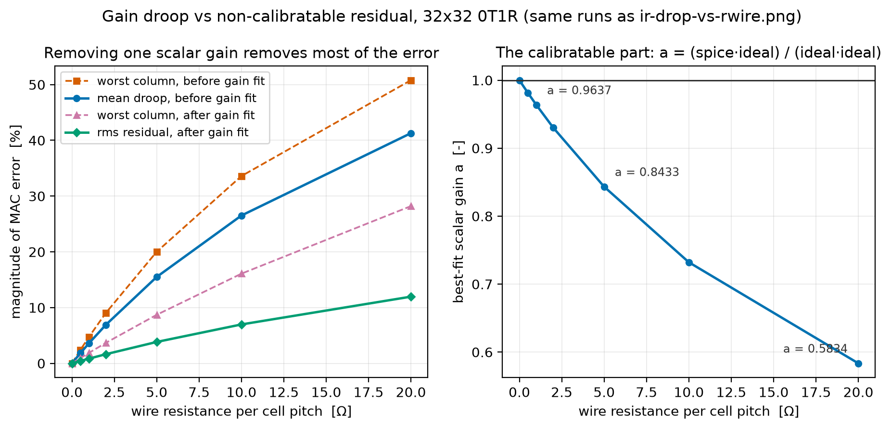
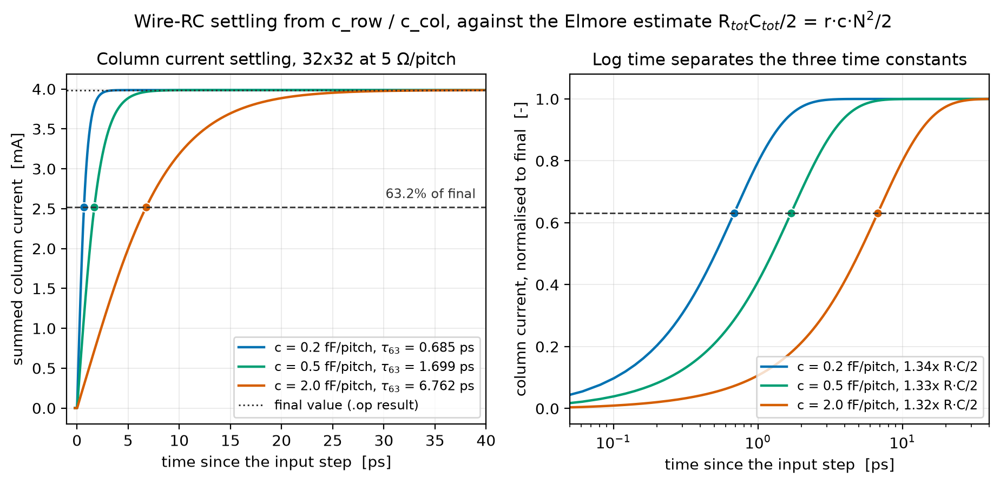
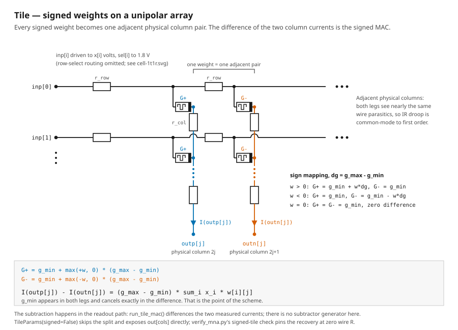

# Results report — analog compute-in-memory crossbar

All numbers below were produced by running the simulations in this repository on
ngspice-47 with hdl21 7.0.0 / vlsirtools 7.0.0, and each was independently
re-verified. Where a value could not be established, this report says so.

---

## 1. Scope, and what this is not

**This is a parameterized circuit generator and a simulation study.** The weight
matrix is an elaboration-time *parameter*; the SPICE netlist is a compile output.
The study characterizes how an analog MAC degrades under wire IR drop, access-device
series resistance, and wire RC.

**There is no layout.** Specifically, this project contains no floorplan, no GDS, no
place-and-route, no design-rule checking, no layout-versus-schematic, and no
parasitic extraction. Nothing here has been fabricated or measured on silicon.

That distinction is load-bearing for every number in this report: the wire
resistance and capacitance are **assumed parameters swept over a plausible range**,
not values extracted from a physical implementation. This report can therefore
answer "how does MAC accuracy scale with per-pitch wire resistance?" It cannot
answer "what is the accuracy of this chip?", because there is no chip and no
extracted parasitics to pin `r_row`/`r_col`/`c_row`/`c_col` to real geometry.

---

## 2. Methodology

| Item | Value |
| --- | --- |
| Array | 32x32 (16x16 and 8x8 for the 1T1R and Tile studies) |
| Cell | 0T1R (linear conductance) and 1T1R (conductance + access NMOS) |
| Conductance range | `g_min` = 1 µS, `g_max` = 100 µS |
| Weights | `numpy.default_rng(0)`, uniform in [0, 1]; signed cases uniform in [-1, 1] |
| Stimulus | `x = rng.random(N) * 0.2`, i.e. 0–200 mV read voltages |
| Readout | 0 V voltage sources per column as ideal TIA virtual grounds; column current read as `i(v.xtop.vvsense<j>)` |
| Analysis | `.op` for MAC accuracy; `.tran` for settling |
| Simulator | ngspice-47, `tt` corner for sky130 |
| Access device | generic level-1 placeholder, or `sky130_fd_pr__nfet_01v8` at W/L = 1 µm / 180 nm |

The reference for MAC accuracy is the **zero-parasitic 0T1R ideal**, `G.T @ x`
(`ideal_0t1r`). It is not a valid reference for 1T1R — see §5.

---

## 3. Verification: two independent solvers

The strongest correctness claim in this project is not that the tests pass, but that
the SPICE result was reproduced by an **independently written solver**.
`verify_mna.py` builds the crossbar's nodal-analysis system directly in numpy from
the asserted topology and solves it with `numpy.linalg.solve`, sharing no code with
hdl21, vlsirtools, or ngspice.

| `r_wire` [Ω/pitch] | ngspice vs numpy MNA, max relative difference |
| --- | --- |
| 1.0 | 6.58e-12 |
| 5.0 | 1.01e-12 |
| 20.0 | 1.25e-12 |
| 0.0 | 3.49e-15 (vs closed-form `G.T @ x`) |

Why this is stronger than a self-consistent test: a test suite written against the
same code path can only detect regressions, not a topology that was wrong from the
start. Agreement to ~1e-12 between a hand-derived nodal system and a third-party
circuit simulator means the netlist has the intended topology *and* that the
operating point is being read out of the rawfile correctly. A shared misconception
would have to corrupt both paths identically to survive.

Additional structural checks, rather than numeric ones:

- Cell resistances netlist correctly: `w = 0.5` → `1/(1 µS + 0.5 · 99 µS)` = 19801.98 Ω, confirmed in the deck.
- `c_row = c_col = 0` stamps **zero** capacitor cards; `c = 1e-15` on a 2x2 stamps **8** (4 row taps + 4 column taps). The operating-point netlist is therefore structurally identical to the R-only case, not merely numerically close.
- `verify_mna.py` runs **9 checks**; all pass.

---

## 4. Wire IR drop, and why the headline error number is misleading


32x32, 0T1R, seed 0:

| `r_wire` [Ω/pitch] | signed mean error | signed worst column | best-fit gain `a` | residual rms | residual worst |
| --- | --- | --- | --- | --- | --- |
| 0.0 | 0.00% | −0.00% | 1.0000 | 0.00% | 0.00% |
| 1.0 | −3.59% | −4.72% | 0.9637 | 0.84% | 1.87% |
| 5.0 | −15.50% | −20.01% | 0.8433 | 3.83% | 8.70% |

**The error is strictly one-sided.** `spice − ideal` is negative on every column at
every nonzero `r_wire`. IR drop can only reduce the voltage across a cell, so it can
only reduce current. Reporting `abs(error)` — as the original code did — hides this
and conflates two errors with completely different consequences.

The decomposition that matters:



- **Systematic gain droop** — the signed mean relative error. This is a single
  scalar. The digital path divides it out for free, so it costs no inference
  accuracy.
- **Residual spread** — fit the single best scalar gain
  `a = (spice·ideal)/(ideal·ideal)`, then measure what is left. At 5 Ω/pitch,
  `a = 0.8433` and the residual is 3.83% rms / 8.70% worst-column.

**The number that actually costs accuracy is ~4x smaller than the headline.** A
−15.50% error that is 84% one calibratable gain is a very different engineering
problem from a −15.50% error that is irreducible. The residual grows faster than
linearly in `r_wire` while the droop grows roughly linearly, so the calibratable
fraction *falls* as wire resistance rises — the metric matters more, not less, in
the regime where it hurts.

The gradient's origin is the array's structural asymmetry: drivers attach at the
column-0 end of each row and readout at the last-row end of each column, so the cell
at (row 0, column N−1) sits at the end of the longest resistive path while (row N−1,
column 0) sits at the shortest.

---

## 5. Access device (1T1R): weight-dependent range compression

### 5.1 The device

Measured directly on `sky130_fd_pr__nfet_01v8`, W/L = 1 µm / 180 nm, `tt`:

| Bias | Result |
| --- | --- |
| Vgs = Vds = 1.8 V | 431.5 µA (Idsat, ≈430 µA/µm — sensible for the sky130 1.8 V core device) |
| Vgs = 1.8 V, Vds = 50 mV | **Ron = 844 Ω** |
| In-array implied Ron (crossbar's own bias) | 819 Ω |
| W = 0.5 / 1 / 2 µm | Ron = 1671 / 819 / 365 Ω — a real 1/W trend |

The 1/W trend matters as evidence: a units error in the geometry would be a factor of
10^6 and could not produce a clean inverse-width relationship.

### 5.2 Why `G.T @ x` is invalid for 1T1R

Ron sits in series with the cell, so the effective conductance is
`1/(1/G + Ron)`. Put 844 Ω next to the cell resistances:

| Weight | Cell R | Ron / R_cell | **Actual current loss** `1 − 1/(1 + Ron·G)` |
| --- | --- | --- | --- |
| `w = 1` (`g_max`, 100 µS) | 10.0 kΩ | 8.44% | **7.79%** |
| `w = 0` (`g_min`, 1 µS) | 1.00 MΩ | 0.084% | **0.084%** |

Note these are two different quantities and should not be interchanged: `Ron/R_cell`
is 8.44%, the resulting current loss is 7.79%. A ~90x spread in compression across
the weight range means this is a **nonlinearity in the weight transfer**, not a gain
error.

The table above uses the standalone-deck Ron of 844 Ω (Vds = 50 mV). Measured *in
array*, where Vds across the access device is only ~15 mV, Ron is 819 Ω and the
compression is correspondingly **7.569% at `g_max` against 0.081% at `g_min`** — the
values plotted in the figure below. Both are the same device on the same
Ron-versus-bias curve (Ron rises monotonically from 808 Ω at `w = 0` to 819 Ω at
`w = 1`); quote whichever matches your bias condition, but do not mix them.


Verification that Ron is the entire mechanism: `ideal_1t1r(p, x, ron)`, which is just
`1/(1/G + Ron)` transposed against `x`, reduces the 1T1R error to ~0%. Independent
corroboration on a 2x2 case, `W = ((1.0, 0.5), (0.25, 1.0))`, `x = (0.2, 0.1)`:

| Column | Measured 1T1R / 0T1R | Hand prediction from Ron = 844 Ω | Error |
| --- | --- | --- | --- |
| 0 | 0.9303 | 0.9286 | +0.18% |
| 1 | 0.9424 | 0.9407 | +0.18% |

A closed-form series-resistance calculation predicting a full SPICE result with
sky130 BSIM models to 0.2% is strong evidence both are right. The residual 0.2% is
Ron's bias dependence: re-predicting with the in-array 819 Ω closes most of it.

### 5.3 The consequence depends on weight structure

This is the least intuitive result in the study, and it corrects an earlier
overstatement in this project's own notes. Whether per-cell compression shows up as
*calibratable gain* or *irreducible error* depends on the weight distribution.
16x16, sky130 1T1R, zero wire R:

| Weights | signed droop | best-fit `a` | residual rms | residual worst |
| --- | --- | --- | --- | --- |
| i.i.d. uniform random | −5.32% | 0.9457 | **0.48%** | 1.16% |
| graded by column | −3.89% | 0.9409 | **3.06%** | 5.83% |

Mechanism: each column current sums many cells spread across the compression curve.
With unstructured weights, every column's *mean* compression converges to nearly the
same value, so a single scalar gain removes it. Weight **structure** breaks that
averaging — if column *j* systematically holds larger weights, it is systematically
compressed harder, and no array-level gain can fix per-column differences.

**The random-weight case is the optimistic one.** Real trained networks have
structured weights, so ~0.5% residual should be read as a floor, not an expectation.
The ~6x spread between these two cases is the actionable finding.

**Design implication.** A 100 µS `g_max` is what makes an 844 Ω switch matter. Two
levers: widen the access FET (W = 2 µm roughly halves Ron to 365 Ω) or lower `g_max`.
Lowering `g_max` also shrinks signal current, so it trades compression against SNR
and readout integration time.

---

## 6. Wire RC settling



32x32 at 5 Ω/pitch, transient, measured 63% settling of the summed column current
against the analytic Elmore estimate `R_tot · C_tot / 2 = r · c · N² / 2`:

| `c` per pitch | measured tau_63 | `R·C/2` estimate | ratio |
| --- | --- | --- | --- |
| 0 | 1.264e-14 s | — (no RC pole; this is the driver rise time) | — |
| 0.2 fF | 6.854e-13 s | 5.120e-13 s | 1.34x |
| 2 fF | 6.762e-12 s | 5.120e-12 s | 1.32x |

The ~1.3x offset is the expected discrepancy between a multi-pole distributed RC line
and a single-pole lumped estimate. It holds constant across a 10x change in `c`, and
tau scales linearly in `c` as it must — which is the real content of this check: the
capacitors are electrically present and behaving, not decorative.

**Takeaway: the array's own RC pole is sub-picosecond.** At any plausible per-pitch
wire capacitance, the wire is not what limits read time — the readout amplifier's
bandwidth is. Do not spend design effort on array RC before the TIA is settled.

---

## 7. Signed Tile: differential column pairs



Each signed weight `w ∈ [-1, 1]` becomes two adjacent physical columns,
`G+ = g_min + max(+w,0)·Δ` and `G- = g_min + max(-w,0)·Δ` with `Δ = g_max − g_min`.
Since `max(w,0) − max(−w,0) = w` identically, the difference is

```
I(outp[j]) - I(outn[j]) = (g_max - g_min) * sum_i x_i * w[i][j]
```

and the `g_min` offset cancels **exactly** — that is the point of the scheme.

| `r_wire` [Ω/pitch] | max relative error vs `(g_max − g_min) · W_signed.T @ x` |
| --- | --- |
| 0.0 | 2.01e-15 |
| 5.0 | 1.25e-02 |

Sign handling is also checked directly: negative weights produce negative
differential currents, and the sign of every column matches the reference.

### 7.1 A negative result: differencing does not improve relative accuracy

It is tempting to assume that because the two legs of a pair are adjacent, they see
nearly the same wire parasitics, so IR-drop error is common-mode and largely cancels.
**Measurement does not support the practical version of that claim.** 8x8 signed
tile, comparing 5 Ω/pitch against the same tile at 0 Ω/pitch to isolate IR drop:

| Quantity | G+ leg | G− leg | Difference |
| --- | --- | --- | --- |
| mean \|signal\| | 25.34 µA | 17.06 µA | 16.82 µA |
| mean \|absolute error\| | 326.0 nA | 298.5 nA | **266.5 nA** |
| mean relative error | −1.36% | −1.52% | **−1.71%** |
| worst relative error | 1.97% | 2.23% | **3.17%** |

Both halves of this are real and they point in opposite directions:

- **Cancellation exists.** The difference's absolute error (266.5 nA) is smaller than
  either leg's (326.0, 298.5 nA). The leg errors are positively correlated, which
  only happens if the parasitic effect is partly common-mode. So the rationale is
  sound.
- **It does not help.** The cancellation is ~18%, while the differential *signal* is
  34% smaller than the G+ leg. The signal shrinks faster than the error, so relative
  accuracy is **worse** after differencing: 3.17% worst-case versus 1.97% / 2.23% per
  leg.

The differential scheme should therefore be justified by what it actually delivers —
signed weights and exact `g_min` offset cancellation — and **not** by IR-drop
immunity. "Common-mode to first order" survives as a statement about correlation;
"largely cancels" does not survive as a statement about accuracy.

---

## 8. Two toolchain defects found along the way

Both are upstream, both are documented in the code, and both silently produce wrong
answers rather than errors — which is why they are worth recording.

**1. vlsirtools rawfile parser vs modern ngspice.** vlsirtools 7.0.0 parses the
ngspice rawfile header *by line count*, assuming `Title:` / `Date:` / `Plotname:`
before `Flags:`. ngspice-47 emits an extra `Command:` line, so the parser consumes
`Command:` as the plotname and then fails on `Plotname:` where it expects `Flags:`:

```
ValueError: Invalid flags ['Plotname:', 'Operating', 'Point']
```

vlsirtools 7.0.0 is the latest release, so there is no upstream fix to take.
`ngspice_compat.py` rebinds `parse_nutbin` to scan forward to the `Plotname:` line
instead of counting, which is tolerant of both old and new ngspice.

**2. sky130-hdl21 drops the micron scaling for `Prefixed` values.** The sky130
ngspice library sets `.option scale=1.0u`, so deck geometry is in microns.
`sky130_hdl21/pdk_logic.py:351` type-dispatches the conversion:

```python
def scale_param(self, orig, default):
    if isinstance(orig, h.Prefixed):
        return orig            # FIXME: where's the scaling?
    if isinstance(orig, h.Literal):
        return h.Literal(f"({orig.text} * 1e6)")
```

It scales SI→µm for `h.Literal` and **skips it for `h.Prefixed`**, with an upstream
FIXME acknowledging the bug. An unscaled SI value arrives 10^6 too small, misses
every binned `.model`, and the only symptom is
`could not find a valid modelname`. `crossbar.py` converts `Prefixed`→`Literal` on
the sky130 path (`si_literal`), so `w_acc`/`l_acc` are **SI on both routes** and the
shipped defaults work. Two checks pin it: the deck must literally contain
`w='(1e-06 * 1e6)'`, and measured Ron must land in 300–3000 Ω, a band no 10^6 unit
slip can survive.

Note that `sky130_hdl21`'s own `default_xtor_size` values are `Prefixed`
(e.g. `0.42 * MICRO`), so they take the unscaled path.

---

## 9. Limitations and threats to validity

Read this section before quoting any number above.

**No physical implementation.** No layout, GDS, DRC, LVS, or parasitic extraction.
`r_row`/`r_col`/`c_row`/`c_col` are *assumed* per-pitch values swept over a plausible
range, not extracted from geometry. Every absolute accuracy figure is conditional on
those assumptions. Real arrays also have non-uniform parasitics (wire width changes,
via resistance, contact resistance) that a uniform per-pitch R does not represent.

**The memristor is a linear resistor.** No I–V nonlinearity, no conductance drift or
relaxation, no read noise, no random telegraph noise, no cycle-to-cycle or
device-to-device variation, no yield or stuck-at defects, no retention or endurance
model, and no programming/write dynamics. In published ReRAM arrays, device variation
is frequently the dominant accuracy limit — larger than the IR drop characterized
here. Its absence is the single biggest gap between this study and a real array.

**Analysis coverage.** Operating point and small-signal transient only. No noise
analysis, no temperature sweep, no Monte Carlo, and only the `tt` corner — the sky130
library ships ff/ss/sf/fs/ll and none were swept. No statistical confidence intervals
anywhere.

**Idealized periphery.** Readout is a 0 V voltage source: an ideal TIA with infinite
gain and bandwidth, zero offset, zero input-referred noise, and zero input impedance.
Drivers are ideal voltage sources with no output impedance, settling time, or DAC
nonlinearity. There is no ADC, so no quantization noise, no ADC nonlinearity, and no
column-mux settling — and quantization is typically what sets end-to-end inference
accuracy. `mux`/`adc_bits`/`in_bits` were removed from `TileParams` precisely because
no circuit backed them.

**Statistical weakness.** Results come from a single random weight matrix and a
single stimulus vector at one seed. §5.3 shows the conclusion is *sensitive to weight
structure*, which means one random matrix is not an adequate basis for an accuracy
claim. A proper study needs many matrices, realistic trained-network weight
distributions, and a distribution of input vectors.

**The generic access model is uncalibrated.** The level-1 placeholder
(`vto=0.5 kp=120u lambda=0.05`) exists to make the 1T1R topology simulate with no PDK
installed. Its implied Ron is ~1162 Ω against a level-1 hand estimate of 1153.8 Ω, but
against the real sky130 device's 819 Ω it is ~42% pessimistic. Right order of
magnitude, nothing more. No performance conclusion should be drawn from it.

**Ron is bias-dependent.** `ideal_1t1r` uses a fixed Ron and is therefore an
approximation. It happens to work well here (~0% residual) because the read voltages
are small and the columns are held at virtual ground, keeping every access device in
its linear region. It should not be expected to hold at larger read voltages.

**Scale.** The largest array simulated is 32x32. IR drop grows with array dimension,
so these percentages are not transferable to the 128x128–1024x1024 arrays typical of
published CIM macros. Nothing here establishes how the residual scales with N.

---

## 10. Reproduction

```bash
uv sync
brew install ngspice          # verified on ngspice-47

uv run crossbar.py            # 32x32 MAC sweep vs wire resistance
uv run verify_mna.py          # 9 checks, incl. the independent numpy MNA solve
uv run scripts/make_figures.py  # regenerate every figure in this report
```

For the sky130 1T1R path (optional; ~2.1 GB):

```bash
uv tool install volare
volare enable --pdk sky130 c6d73a35f524070e85faff4a6a9eef49553ebc2b
```

The PDK is discovered via `$PDK_ROOT`, then `$VOLARE_ROOT`, then `~/.volare`. Without
it, the 1T1R path falls back to the generic placeholder model and `verify_mna.py`
still passes — the sky130 simulation check skips rather than fails.

See [DESIGN.md](DESIGN.md) for the generator architecture and the full parameter
reference.
